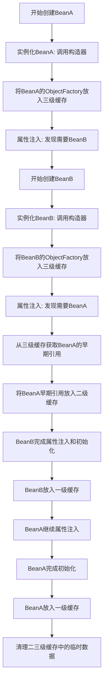

[toc]

大家好，我是你们的技术老友**科威舟**，今天聊聊三级缓存如何巧妙解决循环依赖难题。

> 在日常开发中，你是否遇到过Spring应用启动时报`BeanCurrentlyInCreationException`异常？别担心，这可能是遇到了循环依赖这个"经典难题"。今天，让我们深入剖析Spring是如何优雅地解决这个问题的。

## 什么是循环依赖？

想象一下，两位厨师在厨房做菜：厨师A需要厨师B的锅才能开工，而厨师B也需要厨师A的锅才能开始。两人大眼瞪小眼，都等着对方先提供锅——这就是典型的**循环依赖**场景。

在Spring世界中，循环依赖指两个或多个Bean相互依赖，形成"鸡生蛋、蛋生鸡"的困境：

```java
@Component
public class ServiceA {
    @Autowired
    private ServiceB serviceB;
}

@Component
public class ServiceB {
    @Autowired
    private ServiceA serviceA;  // 循环依赖！
}
```

## Spring的"三级缓存"妙招

Spring通过巧妙的三级缓存机制解决这个问题，就像餐厅设置"备餐区"一样，让厨师可以先把半成品摆出来。

### 三级缓存结构

Spring使用三个Map（俗称三级缓存）来管理Bean的不同状态：

| 缓存级别 | 名称 | 作用 | 生活比喻 |
|---------|------|------|---------|
| 一级缓存 | singletonObjects | 存放完全初始化好的Bean | 已上桌的菜品 |
| 二级缓存 | earlySingletonObjects | 存放提前曝光的半成品Bean | 配好待炒的食材 |
| 三级缓存 | singletonFactories | 存放Bean工厂，用于生成早期引用 | 厨师的烹饪技巧 |

### 解决流程详解

下面通过流程图展示Spring解决循环依赖的完整过程：




具体步骤是这样的：

1. **创建BeanA**：Spring实例化BeanA（调用构造器），此时BeanA还是"半成品"
2. **提前曝光**：将BeanA的ObjectFactory放入三级缓存，相当于"我先声明这个锅我用了"
3. **发现依赖**：为BeanA注入属性时发现需要BeanB
4. **创建BeanB**：开始创建BeanB，同样实例化并曝光其ObjectFactory
5. **解决关键**：BeanB需要BeanA时，从三级缓存拿到BeanA的早期引用
6. **完成注入**：BeanB完成初始化后，BeanA继续完成剩余工作

这个过程中，**三级缓存的核心价值在于它存储的不是对象本身，而是能够生成对象的工厂**，这样就能在需要的时候判断是否要创建代理对象，保证AOP等功能正常工作。

## 实战场景分析

### 场景一：字段注入（Spring可解决）

```java
@Service
public class UserService {
    @Autowired
    private OrderService orderService;
    
    public User findUserWithOrders(Long userId) {
        // 业务逻辑
        return orderService.decorateUserWithOrders(userId);
    }
}

@Service
public class OrderService {
    @Autowired
    private UserService userService;  // 循环依赖
    
    public Order findOrderWithUser(Long orderId) {
        // 业务逻辑
        return userService.decorateOrderWithUser(orderId);
    }
}
```

**结果**：✅ Spring成功解决，应用正常启动

### 场景二：构造器注入（Spring无法解决）

```java
@Service
public class ProductService {
    private final InventoryService inventoryService;
    
    @Autowired
    public ProductService(InventoryService inventoryService) {
        this.inventoryService = inventoryService;  // 构造时就需要完整依赖
    }
}

@Service
public class InventoryService {
    private final ProductService productService;
    
    @Autowired
    public InventoryService(ProductService productService) {
        this.productService = productService;  // 死锁！
    }
}
```

**结果**：❌ 启动失败，抛出`BeanCurrentlyInCreationException`

**原因**：构造器注入在实例化阶段就需要完整依赖对象，而此时Bean的ObjectFactory还没放入三级缓存。

### 场景三：原型Bean的循环依赖

```java
@Scope(ConfigurableBeanFactory.SCOPE_PROTOTYPE)
@Service
public class ProtoA {
    @Autowired
    private ProtoB protoB;
}

@Scope(ConfigurableBeanFactory.SCOPE_PROTOTYPE)
@Service
public class ProtoB {
    @Autowired
    private ProtoA protoA;  // 原型Bean的循环依赖
}
```

**结果**：❌ Spring无法解决

**原因**：原型Bean每次都会新建实例，不会放入缓存中，无法提前暴露引用。

## 解决方案与最佳实践

### 1. 使用@Lazy注解（推荐）

```java
@Service
public class LazyUserService {
    @Autowired
    @Lazy  // 延迟加载
    private LazyOrderService orderService;
}
```

`@Lazy`告诉Spring延迟初始化依赖，打破循环。

### 2. 重构设计（根本解决）

提取公共逻辑到第三个Service中：

```java
@Service
public class UserService {
    @Autowired
    private CommonService commonService;
}

@Service
public class OrderService {
    @Autowired
    private CommonService commonService;  // 共同依赖第三方
}

@Service
public class CommonService {
    // 处理用户和订单的公共逻辑
}
```

### 3. 使用Setter注入

```java
@Service
public class SetterUserService {
    private SetterOrderService orderService;
    
    @Autowired
    public void setOrderService(SetterOrderService orderService) {
        this.orderService = orderService;
    }
}
```

## 为什么需要三级缓存？

有读者可能会问：二级缓存不就够用了吗？为什么还要设计三级缓存？

关键在于**AOP代理**。如果Bean需要被代理（如使用`@Transactional`），二级缓存直接存储原始对象会导致不一致：ServiceB中注入的是原始BeanA，而其他地方注入的是代理BeanA。

三级缓存的ObjectFactory的`getObject()`方法会判断Bean是否需要代理，并返回相应的对象，保证了注入一致性。

## 总结

Spring的三级缓存机制巧妙地解决了大部分循环依赖问题，但其能力有限：

| 场景 | 能否解决 | 原因 |
|------|---------|------|
| 单例Bean + 字段/Setter注入 | ✅ | 三级缓存提前暴露引用 |
| 构造器注入 | ❌ | 实例化阶段就需要完整依赖 |
| 原型Bean循环依赖 | ❌ | 不进入缓存机制 |
| BeanPostProcessor参与 | ⚠️ | 优先级冲突可能导致失败 |

**最佳实践**：虽然Spring提供了解决方案，但循环依赖本质是设计问题。建议优先通过重构代码消除循环依赖，保持架构清晰。

记住：**Spring的缓存机制是你的安全网，而不是你走钢丝的平衡杆**。良好的设计比依赖框架特性更可靠！

## 参考文章

1. https://bbs.huaweicloud.com/blogs/451654
2. https://www.cloud.tencent.com/developer/article/2580458
3. https://comate.baidu.com/zh/page/hmn5t2brg2j
4. https://comate.baidu.com/zh/page/8v9lu692bec
5. https://developer.aliyun.com/article/1005272
6. https://blog.csdn.net/qq_45772447/article/details/149326222
7. https://blog.csdn.net/ljx1129071273/article/details/153818947
8. https://juejin.cn/post/7543097146976813065
9. https://blog.csdn.net/weixin_42679286/article/details/108323704

* 本文主要观点基于以上参考资料，结合实际开发经验整理而成。转载请注明出处。*

---
更多技术干货欢迎关注微信公众号**科威舟的AI笔记**~


【转载须知】：**转载请注明原文出处及作者信息**

