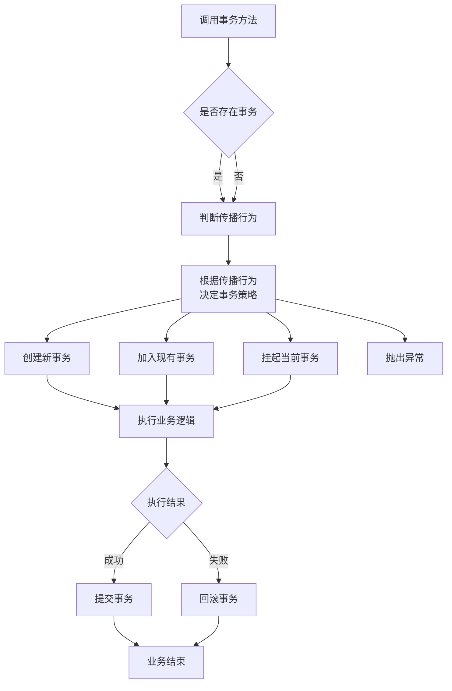

[toc]

大家好，我是你们的技术老友**科威舟**，今天给大家分享一下 Spring事务传播机制。


> 深入掌握事务传播机制，让数据一致性不再成为烦恼

在日常开发中，你是否遇到过这样的场景：订单创建成功了，但积分却没增加？或者用户付款了，库存却没减少？这些问题往往源于对Spring事务传播行为理解不透彻。今天，我们就来深入剖析Spring事务的七种传播行为，让你的业务逻辑更加稳健可靠。

## 一、什么是事务传播行为？

简单来说，**事务传播行为定义了"事务方法调用事务方法时，事务该如何传递"的规则**。就像团队协作一样，当多个任务需要协调时，我们需要明确各自的职责边界：是新开一个任务，还是加入现有任务？是独立完成，还是依赖上级任务？

Spring通过`@Transactional`注解的`propagation`属性来控制这一行为，共提供了7种传播类型满足不同业务场景需求。

## 二、七种传播行为详解

### 1. REQUIRED（默认行为） - "有福同享，有难同当"

**行为**：如果当前没有事务，就新建一个事务；如果已经存在一个事务中，加入这个事务。

**比喻**：就像团队合作完成项目，如果已经有项目组了，就加入其中；如果还没有项目组，就自己创建一个。

**代码示例**：
```java
@Transactional(propagation = Propagation.REQUIRED)
public void createOrder(Order order) {
    // 订单核心业务逻辑
    orderDao.save(order);
    inventoryService.reduceStock(order.getItems()); // 调用其他REQUIRED方法
}
```

**适用场景**：大多数需要保证一致性的业务方法，如订单创建、数据更新等。

### 2. REQUIRES_NEW - "我的地盘我做主"

**行为**：无论如何都会新建一个事务，如果当前有事务则会将原来事务挂起。

**比喻**：就像公司内部成立一个完全独立的特种部队，不受常规管理体系的约束。

**代码示例**：
```java
@Transactional(propagation = Propagation.REQUIRES_NEW)
public void auditLog(Action action) {
    // 审计日志记录，无论主业务是否成功都需要记录
    auditDao.save(action);
}
```

**适用场景**：日志记录、消息发送等需要独立于主业务的操作。

### 3. NESTED - "有限自主权"

**行为**：如果当前存在事务，则在嵌套事务内执行；如果当前没有事务，则新建事务。

**比喻**：就像大项目中的子项目，子项目可以独立回滚而不影响整个项目，但主项目回滚会连带子项目回滚。

**代码示例**：
```java
@Transactional(propagation = Propagation.REQUIRED)
public void processBatchOrders(List<Order> orders) {
    for (Order order : orders) {
        try {
            processSingleOrder(order); // 嵌套事务执行
        } catch (Exception e) {
            // 单条订单失败不影响整体批次处理
            log.error("订单处理失败: {}", order.getId(), e);
        }
    }
}

@Transactional(propagation = Propagation.NESTED)
public void processSingleOrder(Order order) {
    // 处理单个订单逻辑
}
```

**适用场景**：批量操作中的单条记录处理、可部分回滚的业务场景。

### 4. SUPPORTS - "随遇而安"

**行为**：如果当前有事务，则加入该事务；如果没有事务，则以非事务方式执行。

**比喻**：就像临时协助的同事，你有任务我就帮忙，没任务我就做自己的事。

**适用场景**：查询操作，可事务可非事务。

### 5. MANDATORY - "必须有靠山"

**行为**：必须在已有事务中运行，否则抛出异常。

**比喻**：就像必须要有上级授权才能执行的任务。

**适用场景**：关键业务操作，必须在事务管控下执行。

### 6. NOT_SUPPORTED - "独立工作者"

**行为**：以非事务方式执行操作，如果当前存在事务，则挂起当前事务。

**比喻**：就像不受公司体系约束的外部顾问。

**适用场景**：不需要事务支持的操作，如数据缓存更新。

### 7. NEVER - "独行侠"

**行为**：以非事务方式执行，如果当前存在事务，则抛出异常。

**比喻**：就像明确要求不能有任何约束的工作。

**适用场景**：数据校验、健康检查等严格非事务场景。

## 三、事务传播机制底层原理

Spring通过**AOP（面向切面编程）**实现事务传播。当我们调用`@Transactional`注解的方法时，实际调用的是Spring生成的代理对象。

### 事务执行流程图




### 核心源码分析

Spring处理事务传播的核心逻辑在`TransactionAspectSupport`类中：

```java
public abstract class TransactionAspectSupport {
    protected Object invokeWithinTransaction(Method method, 
            Class<?> targetClass, final InvocationCallback invocation) {
        
        // 获取事务属性
        TransactionAttribute txAttr = getTransactionAttributeSource()
            .getTransactionAttribute(method, targetClass);
        
        // 获取事务管理器
        PlatformTransactionManager tm = determineTransactionManager(txAttr);
        
        // 创建事务（处理传播行为）
        TransactionInfo txInfo = createTransactionIfNecessary(tm, txAttr, joinpointIdentification);
        
        try {
            // 执行业务方法
            Object retVal = invocation.proceedWithInvocation();
            
            // 提交事务
            commitTransactionAfterReturning(txInfo);
            return retVal;
        } catch (Throwable ex) {
            // 异常回滚处理
            completeTransactionAfterThrowing(txInfo, ex);
            throw ex;
        } finally {
            cleanupTransactionInfo(txInfo);
        }
    }
}
```

对于REQUIRED传播行为，Spring会检查当前线程是否已存在事务：

```java
// AbstractPlatformTransactionManager
private TransactionStatus handleExistingTransaction(
        TransactionDefinition definition, Object transaction, boolean debugEnabled) {
    
    // REQUIRED传播行为处理
    if (definition.getPropagationBehavior() == TransactionDefinition.PROPAGATION_REQUIRED) {
        // 嵌套事务处理
        if (isNestedTransactionAllowed()) {
            return prepareTransactionStatus(
                    definition, transaction, true, newSynchronization, debugEnabled, null);
        }
        // 加入现有事务
        return prepareTransactionStatus(
                definition, transaction, false, newSynchronization, debugEnabled, null);
    }
    // 其他传播行为处理...
}
```

## 四、实战场景与避坑指南

### 场景1：订单支付流程

```java
@Service
public class OrderService {
    
    @Transactional(propagation = Propagation.REQUIRED)
    public void completePayment(Long orderId, Payment payment) {
        // 更新订单状态
        orderDao.updateStatus(orderId, OrderStatus.PAID);
        
        // 记录支付信息（需要独立事务）
        paymentService.recordPayment(payment);
        
        // 发送支付成功通知（非关键操作，不需要事务）
        notificationService.sendPaymentSuccess(orderId);
    }
}

@Service
public class PaymentService {
    
    @Transactional(propagation = Propagation.REQUIRES_NEW)
    public void recordPayment(Payment payment) {
        // 支付记录必须独立保存，即使订单失败也要记录
        paymentDao.save(payment);
    }
}

@Service
public class NotificationService {
    
    @Transactional(propagation = Propagation.NOT_SUPPORTED)
    public void sendPaymentSuccess(Long orderId) {
        // 发送通知，不参与事务
        messagingTemplate.send(destination, message);
    }
}
```

### 场景2：数据批量处理

```java
@Service
public class DataMigrationService {
    
    @Transactional(propagation = Propagation.REQUIRED)
    public void migrateUserData(List<User> users) {
        for (User user : users) {
            try {
                // 单条用户数据迁移使用嵌套事务
                migrateSingleUser(user);
            } catch (Exception e) {
                // 单条失败不影响整体迁移
                log.error("用户数据迁移失败: {}", user.getId(), e);
            }
        }
    }
    
    @Transactional(propagation = Propagation.NESTED)
    public void migrateSingleUser(User user) {
        userDao.save(user);
        profileDao.save(user.getProfile());
        // 如果此处抛出异常，只回滚当前用户相关操作
    }
}
```

### 常见陷阱与解决方案

**陷阱1：同一类中方法调用导致事务失效**

```java
// 错误示例
@Service
public class OrderService {
    
    public void processOrder(Order order) {
        validateOrder(order); // 直接调用，事务不生效！
        createOrder(order);
    }
    
    @Transactional(propagation = Propagation.REQUIRED)
    public void validateOrder(Order order) {
        // 验证逻辑
    }
}

// 正确方案：自注入代理对象
@Service
public class OrderService {
    @Autowired
    private OrderService self; // 注入代理对象
    
    public void processOrder(Order order) {
        self.validateOrder(order); // 通过代理调用
        createOrder(order);
    }
    
    @Transactional(propagation = Propagation.REQUIRED)
    public void validateOrder(Order order) {
        // 验证逻辑
    }
}
```

**陷阱2：异常被捕获导致事务不回滚**

```java
// 错误示例
@Transactional
public void processOrder() {
    try {
        paymentService.charge(); // 可能抛出异常
    } catch (Exception e) {
        // 异常被捕获，事务不会回滚！
        log.error("支付失败", e);
    }
}

// 正确方案
@Transactional
public void safeProcessOrder() {
    try {
        paymentService.charge();
    } catch (Exception e) {
        // 手动标记回滚
        TransactionAspectSupport.currentTransactionStatus().setRollbackOnly();
        throw new BusinessException("支付失败", e);
    }
}
```

## 五、性能优化建议

1. **避免长事务**：REQUIRED传播的事务方法应保持精简，执行时间不宜过长。

2. **谨慎使用REQUIRES_NEW**：频繁创建新事务会增加数据库连接池压力。

3. **读写分离**：查询操作使用SUPPORTS或只读事务。

```java
@Transactional(propagation = Propagation.SUPPORTS, readOnly = true)
public Order getOrderDetails(Long id) {
    return orderDao.findById(id);
}
```

## 六、总结与最佳实践

事务传播机制是Spring事务管理的核心概念，正确理解和使用七种传播行为对保证数据一致性至关重要。

**实践建议**：

1. **默认选择REQUIRED**：适用于大多数业务场景
2. **关键操作使用REQUIRES_NEW**：确保核心操作独立提交
3. **批量处理考虑NESTED**：实现局部回滚，提高系统容错性
4. **查询操作使用SUPPORTS**：灵活适应有无事务的环境

记住，没有最好的传播行为，只有最适合业务场景的选择。希望通过本文的讲解，你能在实战中游刃有余地运用事务传播机制，构建更加健壮可靠的系统！

## 参考文章

1. https://comate.baidu.com/zh/page/afr39jt9jkp

2. https://blog.csdn.net/keehom/article/details/114379486

3. https://my.oschina.net/emacs_9603398/blog/18872912

4. https://blog.csdn.net/yiridancan/article/details/146595062

5. https://blog.csdn.net/qq_39515858/article/details/148285348

* 本文主要观点基于以上参考资料，结合实际开发经验整理而成。转载请注明出处。*

---
更多技术干货欢迎关注微信公众号**科威舟的AI笔记**~


【转载须知】：**转载请注明原文出处及作者信息**

