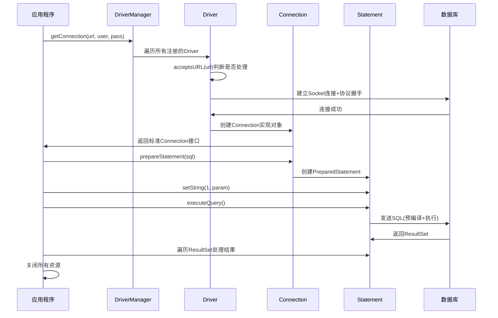

[toc]

大家好，我是你们的技术老友**科威舟**，今天给大家分享一下JDBC的基本概念及原理。

> 如果你以为JDBC只是老掉牙的getConnection()+prepareStatement()，那可能错过了Java数据库访问最精妙的设计

当我们使用Spring Data JPA、MyBatis等ORM框架时，很少会想到底层还有JDBC在默默工作。但一旦遇到连接池泄漏、SQL性能问题或事务异常，理解JDBC就从不必要的知识变成了**救命稻草**。

## 一、JDBC到底是什么？不是驱动，而是规范！

想象一下，如果你家需要接通电源，你不需要知道发电厂是水力发电还是火力发电，只需要把插头插入标准插座即可。JDBC就是这个"**标准插座**"，而各个数据库的驱动则是具体的"发电厂实现"。

### 1.1 三大核心概念辨析

**容易混淆的概念**：很多人认为JDBC就是mysql-connector-java-x.x.x.jar这个文件，其实不然。

- **JDBC规范**：java.sql和javax.sql包中的接口和类（Connection、Statement、ResultSet等）
- **JDBC驱动**：各数据库厂商对JDBC规范的实现（如MySQL的com.mysql.cj.jdbc.Driver）
- **JDBC API**：我们日常使用的DriverManager、DataSource等工具类

```java
// 这不是JDBC的本质！
Class.forName("com.mysql.cj.jdbc.Driver");
Connection conn = DriverManager.getConnection(url, user, pass);

// 这才是JDBC的本质 - 面向接口编程
Connection conn = dataSource.getConnection();  // 获取标准接口
PreparedStatement ps = conn.prepareStatement(sql); // 标准接口
ResultSet rs = ps.executeQuery(); // 标准接口
```

### 1.2 为什么需要JDBC？一场没有标准的灾难

假设没有JDBC，那么每家数据库厂商都会提供自己的连接方式：

```java
// MySQL专用（假设）
MySQLManager manager = new MySQLManager();
MySqlConnection conn = manager.getConnection();

// Oracle专用（假设） 
OracleManager manager = new OracleManager();
OracleConnection conn = manager.getConnection();
```

当公司从Oracle迁移到MySQL时，你需要**重写所有数据库访问代码**！JDBC的出现正是为了解决这种紧耦合问题。

## 二、JDBC执行流程深度剖析

让我们通过一个时序图来理解JDBC的完整执行过程：




### 2.1 DriverManager：JDBC世界的"路由器"

DriverManager不是驱动的实现者，而是**驱动的管理者和选择器**。它的核心工作流程如下：

```java
// 简化版DriverManager.getConnection()逻辑
public static Connection getConnection(String url, Properties info) {
    for (DriverInfo di : registeredDrivers) {
        Driver driver = di.driver;
        // 问每个Driver：这个URL你认识吗？
        if (driver.acceptsURL(url)) {
            // 认识的Driver去建立真实连接
            Connection conn = driver.connect(url, info);
            if (conn != null) return conn;
        }
    }
    throw new SQLException("No suitable driver found");
}
```

**Driver注册的演进**：

1. **远古时代**：手动`Class.forName("com.mysql.cj.jdbc.Driver")`
2. **现代方式**：SPI自动发现（JDBC 4.0+）

SPI机制通过在jar包的`META-INF/services/java.sql.Driver`文件中声明实现类，使得DriverManager能够自动发现并注册驱动，这就是为什么现在**我们不需要再写Class.forName了**。

### 2.2 Connection：数据库会话的"指挥官"

Connection代表一次数据库会话，是**事务管理和语句创建的基石**。

```java
// Connection的核心职责
public interface Connection extends Wrapper, AutoCloseable {
    // 事务管理
    void setAutoCommit(boolean autoCommit) throws SQLException;
    void commit() throws SQLException;
    void rollback() throws SQLException;
    
    // 创建语句
    Statement createStatement() throws SQLException;
    PreparedStatement prepareStatement(String sql) throws SQLException;
    
    // 会话配置
    void setReadOnly(boolean readOnly) throws SQLException;
    void setTransactionIsolation(int level) throws SQLException;
}
```

**事务管理是Connection最容易被误解的特性**：默认autoCommit=true，每条SQL都是一个独立事务；设置为false后，需要手动commit()，否则数据不会持久化。

### 2.3 Statement vs PreparedStatement："静态信使"与"预编译特工"

- **Statement**：像直接送信的信使，每次都要重新组织语言
- **PreparedStatement**：像有模板的特工，效率高且安全

```java
// Statement示例 - 存在SQL注入风险
String sql = "SELECT * FROM users WHERE username = '" + username + "'";
Statement stmt = conn.createStatement();
ResultSet rs = stmt.executeQuery(sql);

// PreparedStatement示例 - 防止SQL注入
String sql = "SELECT * FROM users WHERE username = ?";
PreparedStatement ps = conn.prepareStatement(sql);
ps.setString(1, username);  // 参数安全处理
ResultSet rs = ps.executeQuery();
```

**为什么PreparedStatement更好？**

1. **防止SQL注入**：参数化查询避免恶意SQL拼接
2. **性能提升**：预编译机制，多次执行只需编译一次
3. **可读性更强**：清晰的参数占位符

## 三、JDBC的现代应用场景

### 3.1 连接池：数据库连接的"资源池化"

直接使用DriverManager.getConnection()在生产环境中是**性能杀手**，因为每次都要建立昂贵的物理连接。

```java
// 原始方式 - 性能低下
Connection conn = DriverManager.getConnection(url, user, pass);

// 现代方式 - 使用连接池（如HikariCP）
HikariConfig config = new HikariConfig();
config.setJdbcUrl(url);
config.setUsername(user);
config.setPassword(pass);
HikariDataSource dataSource = new HikariDataSource(config);
Connection conn = dataSource.getConnection();  // 从池中获取，非新建
```

连接池的优化原理：**预先建立一定数量的连接并复用**，避免频繁的TCP握手、认证等开销。

### 3.2 元数据操作：数据库文档自动化生成

JDBC的DatabaseMetaData接口可以**自动获取数据库结构信息**，用于生成文档。

```java
// 获取数据库元数据示例
DatabaseMetaData metaData = conn.getMetaData();

// 获取所有表信息
ResultSet tables = metaData.getTables(null, null, "%", new String[]{"TABLE"});
while (tables.next()) {
    String tableName = tables.getString("TABLE_NAME");
    String remarks = tables.getString("REMARKS");
    System.out.println("表: " + tableName + ", 注释: " + remarks);
}

// 获取表的主键信息  
ResultSet primaryKeys = metaData.getPrimaryKeys(null, null, "users");
while (primaryKeys.next()) {
    String columnName = primaryKeys.getString("COLUMN_NAME");
    System.out.println("主键列: " + columnName);
}
```

基于此原理，可以开发**数据库文档自动生成工具**，避免手动维护文档的繁琐。

### 3.3 事务管理：数据一致性的"守护者"

**典型转账事务示例**：

```java
public boolean transfer(String from, String to, BigDecimal amount) {
    Connection conn = null;
    PreparedStatement debitStmt = null;
    PreparedStatement creditStmt = null;
    
    try {
        conn = dataSource.getConnection();
        conn.setAutoCommit(false);  // 开启事务
        
        // 扣款
        debitStmt = conn.prepareStatement("UPDATE accounts SET balance = balance - ? WHERE id = ?");
        debitStmt.setBigDecimal(1, amount);
        debitStmt.setString(2, from);
        debitStmt.executeUpdate();
        
        // 存款
        creditStmt = conn.prepareStatement("UPDATE accounts SET balance = balance + ? WHERE id = ?");
        creditStmt.setBigDecimal(1, amount);
        creditStmt.setString(2, to);
        creditStmt.executeUpdate();
        
        conn.commit();  // 提交事务
        return true;
        
    } catch (SQLException e) {
        try {
            if (conn != null) conn.rollback();  // 回滚事务
        } catch (SQLException ex) {
            ex.printStackTrace();
        }
        return false;
    } finally {
        // 关闭资源
    }
}
```

## 四、常见陷阱与最佳实践

### 4.1 资源泄漏：最昂贵的错误

**错误示例**：
```java
// 错误！连接没有关闭，最终导致连接池耗尽
public void leakyMethod() {
    Connection conn = dataSource.getConnection();
    // ... 业务逻辑
    // 忘记conn.close()，连接永远无法回收！
}
```

**正确做法**：
```java
// 使用try-with-resources自动关闭
public void safeMethod() {
    try (Connection conn = dataSource.getConnection();
         PreparedStatement ps = conn.prepareStatement(sql)) {
         
        // 业务逻辑
        try (ResultSet rs = ps.executeQuery()) {
            // 处理结果
        }
    } catch (SQLException e) {
        e.printStackTrace();
    }
    // 资源自动关闭，即使在异常情况下
}
```

### 4.2 SQL注入：安全性的头号敌人

使用Statement直接拼接用户输入是**极其危险**的：

```java
// 危险！SQL注入漏洞
String sql = "SELECT * FROM users WHERE username = '" + username + "' AND password = '" + password + "'";
Statement stmt = conn.createStatement();
ResultSet rs = stmt.executeQuery(sql);

// 安全！使用PreparedStatement
String sql = "SELECT * FROM users WHERE username = ? AND password = ?";
PreparedStatement ps = conn.prepareStatement(sql);
ps.setString(1, username);
ps.setString(2, password);
ResultSet rs = ps.executeQuery();
```

## 五、JDBC与现代框架的关系

虽然我们日常使用MyBatis、JPA等ORM框架，但它们**都建立在JDBC之上**。

- **MyBatis**：将JDBC操作封装，提供SQL映射能力
- **JPA/Hibernate**：在JDBC之上提供对象-关系映射
- **Spring JdbcTemplate**：对JDBC的薄封装，简化使用

理解JDBC能让你在遇到ORM框架复杂问题时，有能力**深入底层进行排查**。

## 总结

JDBC作为Java数据库访问的基石，其设计之美在于**关注点分离**：应用程序面向标准接口编程，数据库厂商提供具体实现。即使在2025年，理解JDBC仍然是Java后端开发的**必修课**。

通过本文的深度剖析，希望你能认识到JDBC不仅仅是古老的API，而是精妙的设计规范。下次当你使用高级ORM框架时，不妨想一想底层那个默默无闻却至关重要的JDBC。

---

### 参考文章
1. 《JDBC = Java 访问数据库的最底层规范：从 DriverManager 到 ORM》
2. 《Java JDBC的优雅设计》
3. 《Spring Boot - 构建数据访问层》
4. 《jdbc如何实现数据库访问》
5. 《Mysql学习--05.JDBC工具类》
6. 《【Java】如何用 JDBC 写一个数据库文档生成工具?》

*本文基于JDBC规范和相关技术文档整理，结合实际开发经验深度解读，希望对你的技术成长有所帮助，转载请注明出处。*

---
更多技术干货欢迎关注微信公众号**科威舟的AI笔记**~


【转载须知】：**转载请注明原文出处及作者信息**

