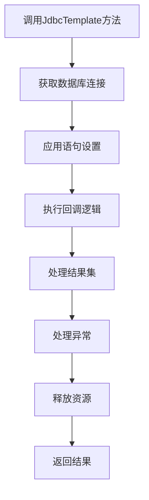
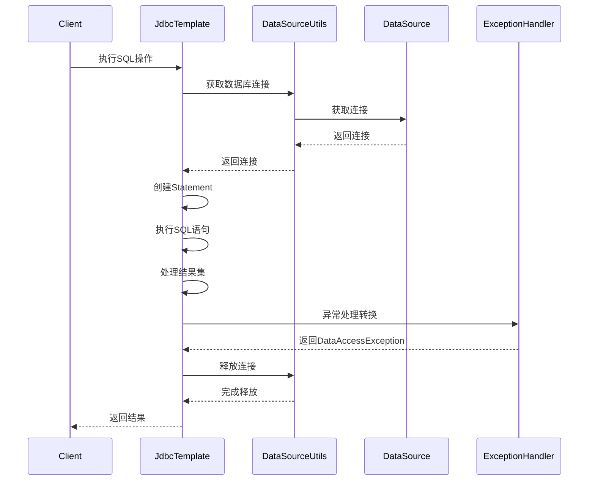

[toc]

大家好，我是你们的技术老友**科威舟**，今天给大家分享一下JdbcTemplate原理及实战。

> 简化JDBC开发，让数据库操作变得轻松愉快

在Java开发的世界里，数据库操作总是一个绕不开的话题。传统的JDBC编程充满了重复代码和复杂异常处理，让不少开发者头疼不已。今天，我们就来深入剖析Spring框架中的JdbcTemplate，看看它如何化身"智能管家"，帮我们轻松应对数据库操作！

## 一、JdbcTemplate：JDBC的"智能升级版"

想象一下，你要泡一杯咖啡，传统JDBC就像是从磨豆、烧水、冲泡全部手动完成，而JdbcTemplate则像是一台全自动咖啡机——只需按下按钮，剩下的它来搞定！

**JdbcTemplate是Spring框架对JDBC的核心封装组件**，旨在简化数据库操作、减少样板代码，并提供安全的资源管理。它通过模板方法模式统一处理异常，将检查异常转为非检查异常，同时自动管理连接、语句和结果集资源，避免原生JDBC中繁琐的try-catch-finally代码块。

与MyBatis或Hibernate等ORM框架相比，JdbcTemplate定位**轻量化**，无SQL与Java对象的复杂映射，适合简单CRUD或复杂SQL直写场景，让开发者直接控制SQL，避免ORM的"黑箱"行为。

## 二、深度剖析：JdbcTemplate的内部魔法

### 2.1 架构设计揭秘

从类继承关系上看，JdbcTemplate继承了基类JdbcAccessor和接口类JdbcOperations。JdbcAccessor负责DataSource数据源的管理和配置，而JdbcOperations则定义了通过JDBC操作数据库的基本操作方法。

```java
// JdbcAccessor确保了数据源的必要性
@Override
public void afterPropertiesSet() {
    if (getDataSource() == null) {
        throw new IllegalArgumentException("Property 'dataSource' is required");
    }
    // ... 其他初始化逻辑
}
```

这种设计体现了**单一职责原则**：JdbcAccessor管"资源"，JdbcOperations管"操作"。

### 2.2 核心执行流程解析

JdbcTemplate的核心执行机制可以通过以下流程图直观展示：




具体来说，当调用JdbcTemplate的某个方法时，会触发以下精细流程：




以上流程在JdbcTemplate的`execute`方法中得以体现，该方法作为其他方法（如`query`、`update`）的基础。以查询操作为例，其内部实现如下：

```java
// JdbcTemplate中query方法的简化实现逻辑
public <T> T query(PreparedStatementCreator psc, 
                   final ResultSetExtractor<T> rse) {
    // 通过execute方法统一执行
    return execute(psc, new PreparedStatementCallback<T>() {
        @Override
        public T doInPreparedStatement(PreparedStatement ps) {
            ResultSet rs = null;
            try {
                rs = ps.executeQuery();
                // 处理结果集
                return rse.extractData(rs);
            } finally {
                JdbcUtils.closeResultSet(rs);
            }
        }
    });
}
```

这一设计体现了**模板方法模式**的精髓：将不变的流程固定下来，将变化的逻辑通过回调接口交给使用者处理。

### 2.3 智能连接管理

JdbcTemplate通过DataSourceUtils管理数据库连接，实现了连接获取和释放的智能化。它能够将连接与当前线程绑定，确保同一事务中的多个操作使用相同的连接。

```java
// DataSourceUtils中的连接管理逻辑
public static Connection doGetConnection(DataSource dataSource) throws SQLException {
    // 尝试从事务同步管理器中获取已绑定的连接
    ConnectionHolder conHolder = TransactionSynchronizationManager.getResource(dataSource);
    if (conHolder != null) {
        return conHolder.getConnection(); // 返回已存在的连接
    }
    // 创建新连接
    return fetchConnection(dataSource);
}
```

这种机制既保证了事务的一致性，又避免了资源的重复创建。

### 2.4 异常处理魔法

JdbcTemplate的另一个亮点是它的**异常转换机制**。它将JDBC的SQLException转换为Spring的DataAccessException体系，使异常处理变得更加一致和直观。

```java
// 异常转换的核心逻辑
protected DataAccessException translateException(String task, String sql, SQLException ex) {
    DataAccessException dae = getExceptionTranslator().translate(task, sql, ex);
    return (dae != null ? dae : new UncategorizedSQLException(task, sql, ex));
}
```

Spring通过SQLErrorCodeSQLExceptionTranslator、SQLExceptionSubclassTranslator和SQLStateSQLExceptionTranslator这三个转换器，按照优先级对不同的数据库错误码进行转换，最终返回有业务意义的异常类型。

## 三、实战场景：JdbcTemplate花式操作数据库

### 3.1 基础CRUD操作

**增删改统一使用update方法**，这是JdbcTemplate的一个设计特点。

```java
@Repository
public class UserDao {
    
    @Autowired
    private JdbcTemplate jdbcTemplate;
    
    // 插入数据
    public int addUser(User user) {
        String sql = "INSERT INTO users (name, email) VALUES (?, ?)";
        return jdbcTemplate.update(sql, user.getName(), user.getEmail());
    }
    
    // 更新数据
    public int updateUser(User user) {
        String sql = "UPDATE users SET name = ?, email = ? WHERE id = ?";
        return jdbcTemplate.update(sql, user.getName(), user.getEmail(), user.getId());
    }
    
    // 删除数据
    public int deleteUserById(Long id) {
        String sql = "DELETE FROM users WHERE id = ?";
        return jdbcTemplate.update(sql, id);
    }
}
```

**查询操作**则根据返回结果的类型和数量，有不同的方法可选：

```java
// 查询单个值
public int getTotalUsers() {
    String sql = "SELECT COUNT(*) FROM users";
    return jdbcTemplate.queryForObject(sql, Integer.class);
}

// 查询单行记录并封装为对象
public User getUserById(Long id) {
    String sql = "SELECT * FROM users WHERE id = ?";
    return jdbcTemplate.queryForObject(sql, new BeanPropertyRowMapper<>(User.class), id);
}

// 查询多行记录
public List<User> getAllUsers() {
    String sql = "SELECT * FROM users";
    return jdbcTemplate.query(sql, new BeanPropertyRowMapper<>(User.class));
}
```

**BeanPropertyRowMapper**是Spring提供的强大工具，它能自动将数据库列名匹配到JavaBean的同名属性（如user_name → userName），大大简化了对象映射工作。

### 3.2 批量操作：性能优化利器

当需要处理大量数据时，批量操作可以显著提升性能。JdbcTemplate提供了batchUpdate方法支持批量操作：

```java
public void batchInsert(List<User> users) {
    String sql = "INSERT INTO users (name, email) VALUES (?, ?)";
    
    jdbcTemplate.batchUpdate(sql, new BatchPreparedStatementSetter() {
        @Override
        public void setValues(PreparedStatement ps, int i) throws SQLException {
            User user = users.get(i);
            ps.setString(1, user.getName());
            ps.setString(2, user.getEmail());
        }
        
        @Override
        public int getBatchSize() {
            return users.size();
        }
    });
}
```

对于更简单的场景，也可以使用参数列表的形进行批量操作：

```java
public void batchInsertSimple(List<User> users) {
    String sql = "INSERT INTO users (name, email) VALUES (?, ?)";
    List<Object[]> batchArgs = new ArrayList<>();
    
    for (User user : users) {
        Object[] params = {user.getName(), user.getEmail()};
        batchArgs.add(params);
    }
    
    jdbcTemplate.batchUpdate(sql, batchArgs);
}
```

### 3.3 高级技巧：获取自增主键

在插入数据时，经常需要获取数据库自动生成的主键值。JdbcTemplate通过KeyHolder实现了这一功能：

```java
public Long addUserWithReturnId(User user) {
    final String sql = "INSERT INTO users (name, email) VALUES (?, ?)";
    
    KeyHolder keyHolder = new GeneratedKeyHolder();
    jdbcTemplate.update(new PreparedStatementCreator() {
        @Override
        public PreparedStatement createPreparedStatement(Connection con) throws SQLException {
            PreparedStatement ps = con.prepareStatement(sql, Statement.RETURN_GENERATED_KEYS);
            ps.setString(1, user.getName());
            ps.setString(2, user.getEmail());
            return ps;
        }
    }, keyHolder);
    
    return keyHolder.getKey().longValue();
}
```

### 3.4 事务管理：确保数据一致性

Spring的声明式事务管理可以与JdbcTemplate完美配合。只需在Service层方法上添加`@Transactional`注解，即可保证操作的原子性：

```java
@Service
public class UserService {
    
    @Autowired
    private JdbcTemplate jdbcTemplate;
    
    @Transactional
    public void transferMoney(Long fromId, Long toId, BigDecimal amount) {
        // 扣款
        jdbcTemplate.update("UPDATE accounts SET balance = balance - ? WHERE id = ?", amount, fromId);
        
        // 加款
        jdbcTemplate.update("UPDATE accounts SET balance = balance + ? WHERE id = ?", amount, toId);
        
        // 如果发生异常，Spring会自动回滚事务
    }
}
```

## 四、Spring Boot中的自动化配置

在Spring Boot项目中，使用JdbcTemplate变得更加简单。只需添加相关依赖，Spring Boot就会自动配置JdbcTemplate：

```xml
<dependency>
    <groupId>org.springframework.boot</groupId>
    <artifactId>spring-boot-starter-jdbc</artifactId>
</dependency>
<dependency>
    <groupId>mysql</groupId>
    <artifactId>mysql-connector-java</artifactId>
</dependency>
```

在application.properties中配置数据源：

```properties
spring.datasource.url=jdbc:mysql://localhost:3306/test_db
spring.datasource.username=root
spring.datasource.password=123456
spring.datasource.driver-class-name=com.mysql.cj.jdbc.Driver
```

然后直接注入使用：

```java
@SpringBootTest
class UserDaoTest {
    
    @Autowired
    private JdbcTemplate jdbcTemplate;
    
    @Test
    void testQuery() {
        String sql = "SELECT COUNT(*) FROM users";
        Integer count = jdbcTemplate.queryForObject(sql, Integer.class);
        Assert.assertNotNull(count);
    }
}
```

Spring Boot自动配置的原理在于JdbcTemplateAutoConfiguration类，它会在检测到DataSourc和JdbcTemplate存在于类路径时自动配置JdbcTemplate Bean。

## 五、最佳实践与避坑指南

### 5.1 防止SQL注入

**永远不要使用字符串拼接的方式来构建SQL语句**，这会导致SQL注入安全漏洞。务必使用参数化查询：

```java
// 错误做法（易受SQL注入攻击）
String sql = "SELECT * FROM users WHERE name = '" + name + "'";

// 正确做法（使用参数化查询）
String sql = "SELECT * FROM users WHERE name = ?";
jdbcTemplate.query(sql, new BeanPropertyRowMapper<>(User.class), name);
```

### 5.2 空结果集处理

当使用queryForObject方法查询单条记录时，如果结果集为空，JdbcTemplate会抛出EmptyResultDataAccessException。在实际开发中，我们需要处理这种情况：

```java
public User getUserByIdSafe(Long id) {
    String sql = "SELECT * FROM users WHERE id = ?";
    try {
        return jdbcTemplate.queryForObject(sql, new BeanPropertyRowMapper<>(User.class), id);
    } catch (EmptyResultDataAccessException e) {
        return null; // 或者进行其他处理
    }
}
```

作为替代方案，也可以使用query方法，它返回空列表而不是抛出异常：

```java
public User getUserByIdSafe2(Long id) {
    String sql = "SELECT * FROM users WHERE id = ?";
    List<User> users = jdbcTemplate.query(sql, new BeanPropertyRowMapper<>(User.class), id);
    return users.isEmpty() ? null : users.get(0);
}
```

### 5.3 性能优化建议

1. **使用连接池**：如HikariCP或Druid，避免频繁创建和销毁连接。
2. **合理使用批量操作**：批量插入/更新时，使用batchUpdate方法。
3. **适度使用缓存**：对不常变更的数据进行缓存，减少数据库访问。
4. **优化SQL语句**：避免SELECT *，只查询需要的字段。

## 六、总结：何时选择JdbcTemplate？

JdbcTemplate作为Spring框架的核心组件，在以下场景中表现出色：

1. **中小型项目快速开发**：配置简单，上手快
2. **需要直接控制SQL**：避免ORM框架的"黑箱"操作
3. **轻量级数据访问层**：不需要复杂的对象关系映射
4. **复杂SQL直写场景**：需要利用数据库特有功能时

对于更复杂的场景，可以考虑MyBatis（需复杂SQL动态拼接或多表映射时）或Spring Data JPA（领域模型驱动、追求Repository模式时）作为替代方案。

JdbcTemplate在Spring生态中找到了自己的精确定位：既保留了JDBC的灵活性和控制力，又极大地简化了开发流程。它就像一位经验丰富的管家，默默处理着所有繁琐事务，让主人能够专注于真正的业务逻辑。

希望通过本文的剖析，你能更好地理解和运用这位"智能管家"，让你的数据库操作更加得心应手！

## 参考文章
1. https://blog.csdn.net/gitblog_01081/article/details/148324085
2. https://blog.csdn.net/weixin_39707478/article/details/113084335
3. https://bbs.huaweicloud.com/blogs/443769
4. https://juejin.cn/post/7337241651620954175
5. https://developer.aliyun.com/article/999928
6. https://blog.csdn.net/leijmdas/article/details/149412710
7. https://blog.csdn.net/shenchaohao12321/article/details/86188175
8. https://blog.51cto.com/u_16213591/10168304

* 本文主要观点基于以上参考资料，结合实际开发经验整理而成。转载请注明出处。*

---
更多技术干货欢迎关注微信公众号**科威舟的AI笔记**~


【转载须知】：**转载请注明原文出处及作者信息**

