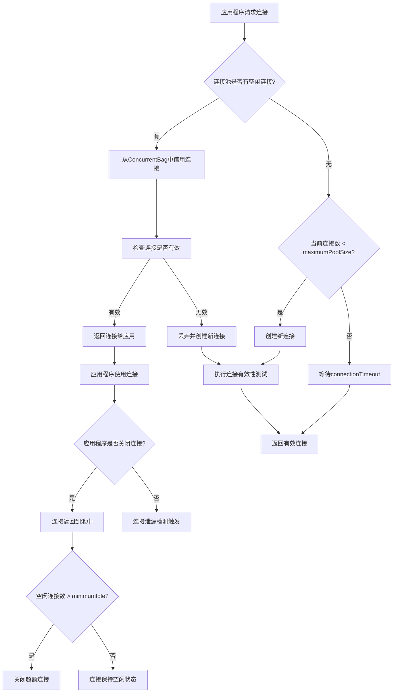

[toc]

大家好，我是你们的技术老友**科威舟**！在日常开发中，数据库连接池是我们经常接触的组件，而HikariCP作为**Spring Boot默认的连接池**，其性能被誉为"速度之王"。今天我们就来深入剖析这款高性能连接池的奥秘！

> 用最幽默的方式，讲解最硬核的技术

## 1. 为什么HikariCP是"连接池界"的超级跑车？

在连接池的世界里，HikariCP就像是一辆精心调校的超级跑车，而其他连接池则更像是家用轿车。那么它到底快在哪里呢？

**HikariCP的高性能秘籍**：

1. **并发优化**：通过自定义的`ConcurrentBag`实现，极大减少了线程间的锁竞争。
2. **字节码优化**：使用javassist直接修改字节码生成动态代理，比传统的CGLib和JDK动态代理更快。
3. **极致简化**：代码量少，稳定性极高，专注于连接池核心功能。

想象一下，传统连接池像是一个需要排队登记的游泳馆，而HikariCP则像是**刷脸进出的智能泳池**，效率自然天壤之别！

## 2. HikariCP核心参数详解：调优的关键所在

连接池配置不是越大越好，而是要找到"黄金平衡点"。下面我们通过一个表格来理解核心参数：

| **参数名** | **默认值** | **说明** | **生活比喻** |
|------------|------------|----------|--------------|
| maximumPoolSize | 10 | 连接池最大连接数 | 泳池最大容纳人数 |
| minimumIdle | 与maxPoolSize一致 | 最小空闲连接数 | 泳池最少保留的救生圈 |
| connectionTimeout | 30000ms | 获取连接超时时间 | 排队等待进入泳池的时间 |
| idleTimeout | 600000ms | 连接最大空闲时间 | 救生圈闲置多久被收回 |
| maxLifetime | 1800000ms | 连接最大存活时间 | 救生圈使用寿命 |

### 2.1 关键参数深度解析

**maximumPoolSize（最大连接数）** - 这是最重要的参数！很多人盲目设置为200、500，这就像在小型泳池里塞进几百人，只会导致所有人都无法正常游泳。

**科学计算公式参考**：
```java
maximumPoolSize = (core_count * 2) + effective_spindle_count
```
其中`core_count`是CPU核心数，`effective_spindle_count`可理解为数据库服务器磁盘阵列数。

**maxLifetime（连接最大存活时间）** - 必须小于数据库的`wait_timeout`（如MySQL默认8小时）。这可以避免应用拿到已被数据库服务器关闭的"僵尸连接"。

## 3. Spring Boot整合HikariCP实战

### 3.1 基础配置

Spring Boot 2.x及以上版本默认使用HikariCP，无需额外引入依赖：

```yaml
# application.yml
spring:
  datasource:
    url: jdbc:mysql://localhost:3306/testdb
    username: root
    password: password
    driver-class-name: com.mysql.cj.jdbc.Driver
    hikari:
      minimum-idle: 5
      maximum-pool-size: 20
      idle-timeout: 600000
      connection-timeout: 30000
      max-lifetime: 1800000
      pool-name: HikariCP
```

### 3.2 多数据源配置实战

在实际项目中，我们经常需要配置多数据源。下面是一个典型的主从数据库配置：

```yaml
# application.yml
spring:
  datasource:
    primary:
      jdbc-url: jdbc:mysql://localhost:3306/db_master
      username: root
      password: master_pwd
      driver-class-name: com.mysql.cj.jdbc.Driver
      hikari:
        minimum-idle: 5
        maximum-pool-size: 20
        pool-name: PrimaryHikariCP
    secondary:
      jdbc-url: jdbc:mysql://localhost:3306/db_slave
      username: root
      password: slave_pwd
      driver-class-name: com.mysql.cj.jdbc.Driver
      hikari:
        minimum-idle: 3
        maximum-pool-size: 10
        pool-name: SecondaryHikariCP
```

Java配置类：

```java
@Configuration
public class DataSourceConfig {
    
    @Bean(name = "primaryDataSource")
    @Primary
    @ConfigurationProperties(prefix = "spring.datasource.primary")
    public DataSource primaryDataSource() {
        return DataSourceBuilder.create().type(HikariDataSource.class).build();
    }
    
    @Bean(name = "secondaryDataSource")
    @ConfigurationProperties(prefix = "spring.datasource.secondary")
    public DataSource secondaryDataSource() {
        return DataSourceBuilder.create().type(HikariDataSource.class).build();
    }
}
```

## 4. HikariCP执行流程深度剖析

为了让大家更直观地理解HikariCP的工作原理，我们通过流程图来展示其核心执行流程：




**流程关键点解析**：

1. **连接获取**：首先尝试从`ConcurrentBag`中借用空闲连接，如果没有且未达最大限制，则创建新连接。
2. **连接验证**：在将连接交给应用前，会执行有效性检测（如`SELECT 1`），避免应用拿到已失效的连接。
3. **连接归还**：应用使用完毕后，连接不是真正关闭，而是返回到池中供其他请求复用。
4. **泄漏检测**：HikariCP内置泄漏检测机制，超过阈值会自动报警。

## 5. 多场景实战案例

### 5.1 高并发电商场景

**场景特点**：秒杀活动期间，瞬间并发量极高，但平时流量较低。

**配置策略**：
```yaml
spring:
  datasource:
    hikari:
      maximum-pool-size: 50           # 提高最大连接数应对峰值
      minimum-idle: 5                 # 平时保持较少空闲连接
      connection-timeout: 3000        # 缩短超时时间，快速失败
      max-lifetime: 1200000           # 缩短连接生命周期，促进刷新
      leak-detection-threshold: 5000  # 开启泄漏检测，防止连接未关闭
```

**实战技巧**：在秒杀活动前，通过JMX动态调整`maximumPoolSize`，活动结束后恢复原设置。

### 5.2 后台管理系统场景

**场景特点**：并发量不高，但查询复杂，连接持有时间较长。

**配置策略**：
```yaml
spring:
  datasource:
    hikari:
      maximum-pool-size: 20
      minimum-idle: 10                # 保持较多空闲连接，避免等待
      idle-timeout: 1200000            # 延长空闲超时时间
      max-lifetime: 1800000            # 正常连接生命周期
      connection-test-query: SELECT 1  # 显式设置连接测试语句
```

## 6. 性能监控与调优建议

### 6.1 监控指标

HikariCP提供了丰富的监控指标，可以通过JMX或Spring Boot Actuator进行监控：

1. **活跃连接数**（Active Connections）：应远小于`maximumPoolSize`
2. **空闲连接数**（Idle Connections）：反映连接的富余程度
3. **等待线程数**（Waiting Threads）：如果持续大于0，说明连接数不足

### 6.2 连接泄漏检测

HikariCP支持连接泄漏自动检测：
```yaml
spring:
  datasource:
    hikari:
      leak-detection-threshold: 5000 # 单位毫秒，5秒未关闭报警
```

当连接泄漏发生时，HikariCP会在日志中输出完整的堆栈信息，帮助快速定位问题代码。

### 6.3 常见问题解决方案

**问题1：连接池耗尽或超时**
- 检查业务代码是否及时关闭连接
- 增大`maximumPoolSize`，优化SQL和业务逻辑

**问题2：连接失效**
- 设置`connectionTestQuery`，如`SELECT 1`
- 保证数据库`wait_timeout`大于`maxLifetime`

## 7. 总结

HikariCP作为高性能连接池的代表，其成功源于**极致优化**和**专注核心功能**的设计理念。通过本文的详细解析，希望大家能够：

1. **深入理解**HikariCP的工作原理和核心参数
2. **熟练配置**Spring Boot与HikariCP的整合
3. **灵活应对**各种业务场景下的连接池调优
4. **快速定位**和解决生产环境中的连接池问题

记住，连接池调优不是一劳永逸的，需要结合**具体业务场景**和**监控数据**进行持续优化。小即是美，合适的才是最好的！

## 参考资料

1. https://blog.csdn.net/onlymscn/article/details/154641670
2. https://blog.csdn.net/weixin_40480299/article/details/151829053
3. https://blog.51cto.com/u_16099194/7919254
4. https://blog.51cto.com/u_16099325/7417349
5. https://www.cnblogs.com/Chary/p/18699578

* 本文主要观点基于以上参考资料，结合实际开发经验整理而成。转载请注明出处。*

---
更多技术干货欢迎关注微信公众号**科威舟的AI笔记**~


【转载须知】：**转载请注明原文出处及作者信息**