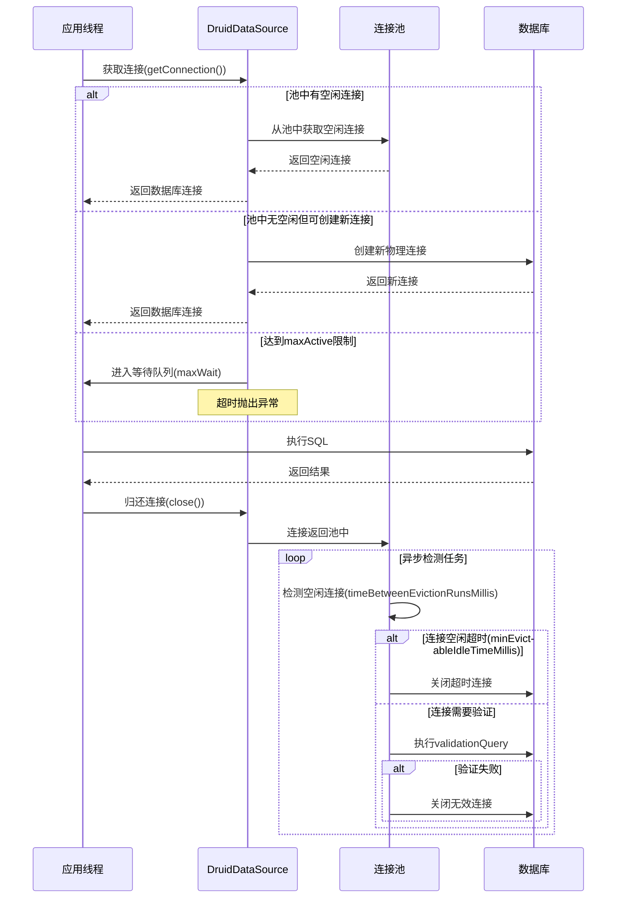

[toc]

大家好，我是你们的技术老友**科威舟**，今天给大家分享一下Druid连接池实战。

## 引言：为什么你的应用需要Druid这个"数据库连接管家"？

在日常开发中，你是否遇到过这样的场景：应用刚上线时运行流畅，随着用户量增加，突然出现`Connection pool exhausted`异常，接口响应时间从几十毫秒飙升到几秒甚至超时？这就像一家餐厅刚开始只有几桌客人，服务员游刃有余，但当客流量暴增时，没有足够服务员导致客人长时间等待。

Druid就是为解决这类问题而生的"数据库连接管家"。它是阿里巴巴开源的高性能Java数据库连接池，在大规模生产环境中经受住了严苛考验，**不仅提供高效的连接管理，还内置强大的监控功能**。

相较于其他连接池，Druid的优势非常明显：

| 特性 | Druid | HikariCP | 传统连接池(C3P0等) |
|-------|-------|----------|-------------------|
| **性能表现** | 高 | 非常高 | 低到中等 |
| **监控能力** | 极其强大 | 基础 | 弱 |
| **安全特性** | 内置SQL防注入 | 不支持 | 不支持 |
| **生产验证** | 阿里巴巴大规模应用 | 广泛使用 | 广泛使用 |

> **Druid号称"为监控而生"**，它的监控功能远超其他连接池，能提供详尽的统计信息，为性能调优和故障排查提供坚实的数据基础。

## 一、Spring Boot中集成Druid的两种方式

### 1.1 使用官方Starter（推荐——懒人专属）

这是目前**最简单、最流行**的集成方式，适合大多数项目。

**第1步：添加Maven依赖**

在`pom.xml`中添加以下依赖（注意排除默认的HikariCP）：

```xml
<dependency>
    <groupId>org.springframework.boot</groupId>
    <artifactId>spring-boot-starter-jdbc</artifactId>
    <exclusions>
        <exclusion>
            <groupId>com.zaxxer</groupId>
            <artifactId>HikariCP</artifactId>
        </exclusion>
    </exclusions>
</dependency>

<dependency>
    <groupId>com.alibaba</groupId>
    <artifactId>druid-spring-boot-starter</artifactId>
    <version>1.2.20</version>
</dependency>
```

**第2步：配置application.yml**

```yaml
spring:
  datasource:
    url: jdbc:mysql://localhost:3306/mydb?useUnicode=true&characterEncoding=utf8&serverTimezone=Asia/Shanghai
    username: root
    password: ${DB_PASSWORD:default_pwd}
    driver-class-name: com.mysql.cj.jdbc.Driver
    type: com.alibaba.druid.pool.DruidDataSource
    
    druid:
      # 连接池大小配置
      initial-size: 5
      min-idle: 5
      max-active: 20
      max-wait: 60000
      
      # 连接有效性检测
      time-between-eviction-runs-millis: 60000
      min-evictable-idle-time-millis: 300000
      validation-query: SELECT 1
      test-while-idle: true
      test-on-borrow: false
      test-on-return: false
      
      # 监控配置
      web-stat-filter:
        enabled: true
        url-pattern: "/*"
        exclusions: "*.js,*.gif,*.jpg,*.png,*.css,*.ico,/druid/*"
        
      stat-view-servlet:
        enabled: true
        url-pattern: /druid/*
        login-username: admin
        login-password: admin
        reset-enable: false
```

**第3步：验证集成**

```java
@SpringBootTest
class ApplicationTests {
    @Autowired
    DataSource dataSource;
    
    @Test
    void contextLoads() {
        System.out.println("当前数据源：" + dataSource.getClass().getName());
        // 输出：com.alibaba.druid.spring.boot.autoconfigure.DruidDataSourceWrapper
    }
}
```

完成以上三步，启动应用并访问 `http://你的服务器地址/druid`，即可看到Druid强大的监控后台。

### 1.2 自定义配置类（传统方式——掌控全局）

这种方式适用于需要**深度定制**的场景，或者在非Spring Boot项目中使用。

```java
@Configuration
public class DruidConfig {
    
    @ConfigurationProperties(prefix = "spring.datasource")
    @Bean
    public DataSource druidDataSource() {
        return new DruidDataSource();
    }
    
    // 配置监控后台的Servlet
    @Bean
    public ServletRegistrationBean<StatViewServlet> statViewServlet() {
        ServletRegistrationBean<StatViewServlet> bean = 
            new ServletRegistrationBean<>(new StatViewServlet(), "/druid/*");
        
        Map<String, String> initParams = new HashMap<>();
        initParams.put("loginUsername", "admin");
        initParams.put("loginPassword", "123456");
        initParams.put("allow", ""); // IP白名单（空表示允许所有）
        
        bean.setInitParameters(initParams);
        return bean;
    }
    
    // 配置Web监控的Filter
    @Bean
    public FilterRegistrationBean<WebStatFilter> webStatFilter() {
        FilterRegistrationBean<WebStatFilter> bean = new FilterRegistrationBean<>();
        bean.setFilter(new WebStatFilter());
        
        Map<String, String> initParams = new HashMap<>();
        initParams.put("exclusions", "*.js,*.gif,*.jpg,*.png,*.css,*.ico,/druid/*");
        bean.setInitParameters(initParams);
        bean.setUrlPatterns(Arrays.asList("/*"));
        
        return bean;
    }
}
```

## 二、Druid核心参数详解：让你的连接池"智能"起来

### 2.1 连接池大小配置：像管理停车场一样管理连接

想象一下，你要设计一个停车场：太小会导致车辆等待，太大则浪费资源。Druid连接池也是同样的道理。

```yaml
druid:
  initial-size: 5     # 初始连接数，就像停车场刚建成时先投放5个车位
  min-idle: 5         # 最小空闲连接数，即使没车也要保留5个车位
  max-active: 50      # 最大活跃连接数，停车场最多容纳50辆车
  max-wait: 60000     # 获取连接最大等待时间（毫秒），等不到车位就放弃
```

**参数调优建议：**
- **初始值设置**：根据应用启动期的并发量调整，通常5-10个连接足够
- **最大连接数**：不是越大越好！需要根据数据库性能和业务并发量平衡
- **最小空闲连接**：保持适当数量的"热连接"，避免频繁创建新连接的开销

### 2.2 连接有效性检测：定期"体检"保证连接健康

数据库连接就像员工，需要定期体检确保健康工作。Druid提供了完善的健康检查机制。

```yaml
druid:
  time-between-eviction-runs-millis: 60000      # 每60秒"巡检"一次空闲连接
  min-evictable-idle-time-millis: 300000        # 空闲5分钟的连接可被回收
  validation-query: SELECT 1                    # 健康检查SQL
  validation-query-timeout: 5                    # 检查超时时间5秒
  test-while-idle: true                         # 空闲时检查（推荐开启）
  test-on-borrow: false                         # 借出时检查（影响性能，不建议）
  test-on-return: false                         # 归还时检查（没必要）
```

**最佳实践**：将`testWhileIdle`设置为`true`，`testOnBorrow`和`testOnReturn`设置为`false`，可以在**不影响性能的前提下保证连接有效性**。

### 2.3 监控配置：Druid的"火眼金睛"

Druid最强大的功能就是监控，它就像给你的数据库安装了**实时监控摄像头**。

**StatViewServlet：监控数据的"展示窗口"**
```yaml
druid:
  stat-view-servlet:
    enabled: true
    url-pattern: /druid/*
    login-username: admin      # 监控页面登录用户名
    login-password: admin      # 监控页面登录密码
    allow: 192.168.1.0/24      # 允许访问的IP段
    deny: 192.168.1.100        # 拒绝访问的IP
```

**WebStatFilter：统计数据的"收集器"**
```yaml
druid:
  web-stat-filter:
    enabled: true
    url-pattern: "/*"
    exclusions: "*.js,*.gif,*.jpg,*.png,*.css,*.ico,/druid/*"
    session-stat-enable: true     # 开启session统计
    session-stat-max-count: 1000  # session最大统计数
```

### 2.4 过滤器配置：Druid的"安全卫士"

Druid通过过滤器链机制提供了丰富的扩展功能。

```yaml
druid:
  filters: stat,wall,slf4j  # 启用统计、防火墙、日志过滤器
  
  filter:
    stat:
      enabled: true
      db-type: mysql
      log-slow-sql: true      # 开启慢SQL记录
      slow-sql-millis: 2000   # 慢SQL阈值（2秒）
    wall:
      enabled: true
      db-type: mysql
      config:
        delete-allow: false    # 禁止删除语句
        drop-table-allow: false # 禁止删表
```

## 三、Druid监控页面详解：你的数据库"驾驶舱"

启动应用后访问`http://localhost:8080/druid`，输入配置的用户名密码，你就进入了Druid的**监控驾驶舱**。

### 3.1 数据源页面
显示连接池的**实时状态**：活跃连接数、空闲连接数、等待线程数等。就像停车场的实时监控，一眼看出车位使用情况。

### 3.2 SQL监控页面
统计所有SQL的执行情况，包括**执行次数、耗时、最慢SQL排行**。帮你快速定位性能瓶颈。

### 3.3 SQL防火墙页面
基于内置的SQL防注入功能，提供**黑白名单访问控制**，有效防御SQL注入攻击。

### 3.4 Web应用页面
统计Controller接口的访问情况，**哪个接口最耗时、调用次数最多**，一目了然。

## 四、实战场景：多场景下的Druid配置策略

### 4.1 场景一：高并发电商系统

**特点**：瞬时并发高，数据库压力大

```yaml
druid:
  initial-size: 10
  min-idle: 10
  max-active: 100
  max-wait: 5000  # 等待时间不宜过长，快速失败
  time-between-eviction-runs-millis: 30000  # 30秒检测一次
  min-evictable-idle-time-millis: 600000    # 10分钟空闲就回收
  
  filter:
    stat:
      slow-sql-millis: 500  # 500ms就视为慢SQL
    wall:
      config:
        select-allow: true
        select-limit: 1000   # 限制每次最多1000条
```

**实战技巧**：配合`test-while-idle`和`validation-query`，确保高并发下连接的健康状态。

### 4.2 场景二：企业内部管理系统

**特点**：并发不高，但数据安全性要求高

```yaml
druid:
  initial-size: 5
  min-idle: 5
  max-active: 20
  max-wait: 30000
  
  filter:
    wall:
      enabled: true
      config:
        delete-allow: false      # 禁止删除
        drop-table-allow: false  # 禁止删表
        truncate-allow: false    # 禁止清空表
```

### 4.3 场景三：数据分析和报表系统

**特点**：查询复杂，执行时间长

```yaml
druid:
  initial-size: 5
  min-idle: 5
  max-active: 50
  max-wait: 120000  # 报表查询可以等待时间长些
    
  filter:
    stat:
      slow-sql-millis: 5000  # 报表系统慢SQL阈值设为5秒
      merge-sql: true        # 合并相似SQL
```

## 五、高级特性与故障排查

### 5.1 PSCache优化：预编译语句缓存

对于需要频繁执行相同SQL的场景，开启PSCache可以**显著提升性能**。

```yaml
druid:
  pool-prepared-statements: true  # 开启PSCache
  max-pool-prepared-statement-per-connection-size: 20  # 每个连接缓存20个语句
```

> **注意**：对于Oracle等支持游标的数据库，PSCache能带来巨大性能提升。MySQL下建议根据实际情况调整。

### 5.2 常见故障排查

**问题1：连接泄漏**
症状：活跃连接数持续增加，不释放
解决方案：开启连接泄漏检测

```yaml
druid:
  remove-abandoned: true
  remove-abandoned-timeout: 1800  # 30分钟不关闭就认为是泄漏
  log-abandoned: true             # 记录泄漏日志
```

**问题2：监控页面无法访问**
检查点：
1. `stat-view-servlet.enabled: true`是否设置
2. IP白名单配置是否正确
3. 登录用户名密码是否匹配

**问题3：慢SQL监控不生效**
检查点：
1. `filters: stat`是否配置
2. `filter.stat.enabled: true`是否开启
3. `log-slow-sql: true`是否设置

## 六、Druid执行流程深度解析

为了更好地理解Druid的工作原理，我们通过一个时序图展示其核心执行流程：




这个流程说明了Druid如何**高效管理连接生命周期**，包括连接的获取、归还、有效性检测和回收。

## 总结

Druid作为一款企业级的数据库连接池，提供了**远超同类产品的监控能力和稳定性**。通过合理的参数配置和监控设置，可以大幅提升应用的数据库访问性能。

**关键要点总结：**
1. **参数调优不是一成不变的**，需要根据实际业务场景调整
2. **监控是Druid的最大优势**，善用监控页面发现性能瓶颈
3. **安全性不容忽视**，通过WallFilter有效防御SQL注入
4. **定期检查连接健康**，避免"僵尸连接"影响系统稳定性

希望本文能帮助你更好地理解和使用Druid，让你的应用数据库性能"飞起来"！如果有任何问题，欢迎在评论区讨论。

## 参考文章
1. https://blog.csdn.net/qq_42320804/article/details/155781890
2. https://blog.csdn.net/weixin_42513928/article/details/155206144
3. https://blog.51cto.com/u_16099276/10316948
4. https://developer.aliyun.com/article/1535601
5. https://gitcode.csdn.net/6630600e16ca5020cb5bca07.html


* 本文主要观点基于以上参考资料，结合实际开发经验整理而成。转载请注明出处。*

---
更多技术干货欢迎关注微信公众号**科威舟的AI笔记**~


【转载须知】：**转载请注明原文出处及作者信息**

