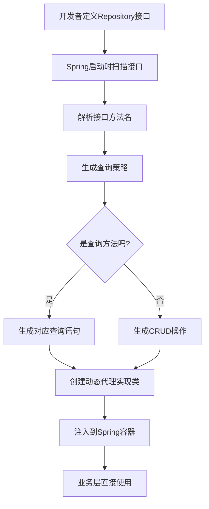
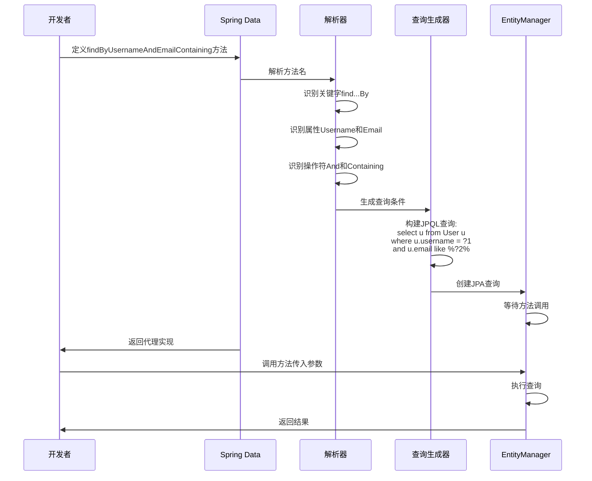

[toc]

大家好，我是你们的技术老友**科威舟**，今天给大家分享一下**Spring Data**。

> 还在为繁琐的DAO层代码发愁吗？Spring Data让数据访问变得像点外卖一样简单！

你是否曾想过，为什么我们每次访问数据库都要写那么多重复的代码？就像每次吃饭都要自己种菜一样费劲。想象一下，如果我们点个外卖就能享受美食，那么为什么数据访问不能也这样简单呢？

Spring Data就是你的“数据访问外卖平台”！它提供了一套统一的数据访问模型，让你用最少的代码完成最常见的数据库操作。今天，就让我们一起踏上Spring Data的探索之旅，从基础使用到原理解剖，让你彻底掌握这项高效的技术。

## 1 Spring Data入门实践

### 1.1 什么是Spring Data？

Spring Data是Spring家族中的一个重要项目，**其主要使命是为数据访问提供一种统一、抽象的编程模型**，同时保留底层数据存储的特殊特性。简单来说，它就像是一个万能的数据访问适配器，无论你使用关系型数据库（MySQL、PostgreSQL）、NoSQL数据库（MongoDB、Redis）还是搜索引擎（Elasticsearch），都能通过相似的接口进行操作。

**核心价值**在于：
- **减少模板代码**：告别重复的CRUD操作
- **统一数据访问层**：多种数据源，同一套API
- **增强代码可测试性**：基于接口的编程更易于模拟和测试

### 1.2 快速开始：Spring Data JPA实战

让我们从一个具体的例子开始，感受Spring Data的魅力。假设我们要实现一个用户管理系统。

首先，在pom.xml中添加依赖：

```xml
<dependency>
    <groupId>org.springframework.boot</groupId>
    <artifactId>spring-boot-starter-data-jpa</artifactId>
</dependency>
<dependency>
    <groupId>com.h2database</groupId>
    <artifactId>h2</artifactId>
    <scope>runtime</scope>
</dependency>
```

接着，定义用户实体：

```java
@Entity
@Table(name = "users")
public class User {
    @Id
    @GeneratedValue(strategy = GenerationType.IDENTITY)
    private Long id;
    
    private String username;
    private String email;
    private Integer age;
    
    // 构造方法、getter、setter省略
}
```

然后，创建Repository接口：

```java
public interface UserRepository extends JpaRepository<User, Long> {
    // 根据用户名查询用户
    List<User> findByUsername(String username);
    
    // 查询指定邮箱域名的所有用户
    List<User> findByEmailEndingWith(String domain);
    
    // 统计年龄大于指定值的用户数量
    Long countByAgeGreaterThan(Integer age);
}
```

最后，在服务层使用：

```java
@Service
@Transactional
public class UserService {
    private final UserRepository userRepository;
    
    public UserService(UserRepository userRepository) {
        this.userRepository = userRepository;
    }
    
    public User createUser(String username, String email, Integer age) {
        User user = new User(username, email, age);
        return userRepository.save(user);
    }
    
    public List<User> findAdults() {
        return userRepository.findByAgeGreaterThan(17);
    }
}
```

看！**我们甚至没有编写任何实现类，就获得了完整的CRUD能力和自定义查询能力**。这就像变魔术一样，但背后是Spring Data的智能机制在发挥作用。

## 2 核心原理剖析

### 2.1 Repository的自动化机制

Spring Data的核心魔法在于**Repository接口的自动化实现机制**。整个过程可以比作点外卖：你下单（定义接口），平台自动处理（Spring Data实现），美食送达（获得实现类）。

以下是Spring Data Repository的自动化实现流程：




这个流程的核心组件包括：

- **RepositoryFactorySupport**：工厂类，负责创建动态代理
- **QueryLookupStrategy**：查询策略，解析方法名成查询
- **MethodInvocationListener**：方法调用监听器，处理实际的方法调用

**动态代理的妙用**在于，它允许Spring在运行时创建接口的实现类。当你调用`userRepository.save(user)`时，实际上调用的是Spring生成的代理类，这个代理类包含了所有的数据库操作逻辑。

### 2.2 查询派生原理

Spring Data最令人惊叹的特性之一就是**查询派生**（Query Derivation）——根据方法名自动生成查询。这就像你告诉助手"我要一杯加冰的奶茶"，助手就能理解所有细节并完成制作。


查询派生的语法解析过程如下：



查询方法解析的关键规则：

1. **主体关键字**：find、read、get、query、count等
2. **限制条件**：Distinct、First、Top等
3. **属性表达式**：实体类的属性名，如Username、Email
4. **谓语关键字**：And、Or、Between、LessThan、Containing等

例如，方法名`findByDepartmentNameAndSalaryGreaterThan`会被解析为：查询某个部门中工资大于指定值的员工，对应的SQL是：`SELECT * FROM employee e JOIN department d ON e.department_id = d.id WHERE d.name = ?1 AND e.salary > ?2`。

### 2.3 事务处理机制

Spring Data默认将Repository方法包装在事务中。**对于查询方法，使用只读事务；对于修改方法，使用读写事务**。这就像图书馆的管理规则：查阅资料（查询）可以在开放区域进行，但借阅归还（修改）需要到柜台处理。

你可以通过`@Transactional`注解自定义事务行为：

```java
public interface UserRepository extends JpaRepository<User, Long> {
    
    @Transactional(readOnly = true, timeout = 30)
    List<User> findComplexQuery();
    
    @Transactional(rollbackFor = {BusinessException.class})
    void updateWithBusinessLogic();
}
```

## 3 多场景应用实战

### 3.1 JPA场景：关系型数据库操作

在传统的企业应用中，**关系型数据库仍然是主流选择**。Spring Data JPA在此基础上提供了更强大的抽象。

**复杂查询示例**：

```java
public interface OrderRepository extends JpaRepository<Order, Long> {
    
    // 多表关联查询：查询指定用户最近30天的订单
    @Query("SELECT o FROM Order o JOIN o.customer c WHERE c.id = ?1 AND o.createTime > ?2")
    List<Order> findRecentOrdersByCustomer(Long customerId, LocalDateTime date);
    
    // 分页查询：按金额降序排列
    Page<Order> findByStatusOrderByAmountDesc(String status, Pageable pageable);
    
    // 投影查询：只返回部分字段
    @Query("SELECT o.id, o.amount, o.status FROM Order o WHERE o.amount > ?1")
    List<Object[]> findOrderSummariesByAmountGreaterThan(BigDecimal minAmount);
}
```

**审计功能**（自动记录创建时间、修改时间）：

```java
@Entity
@EntityListeners(AuditingEntityListener.class)
public class Order {
    @Id
    @GeneratedValue
    private Long id;
    
    @CreatedDate
    private LocalDateTime createTime;
    
    @LastModifiedDate
    private LocalDateTime updateTime;
    
    @CreatedBy
    private String createdBy;
    
    // 其他字段...
}
```

### 3.2 MongoDB场景：文档数据库实践

当处理**非结构化或半结构化数据**时，MongoDB这类文档数据库是更好的选择。Spring Data MongoDB提供了类似的编程模型。

首先配置MongoDB连接：

```yaml
spring:
  data:
    mongodb:
      host: localhost
      port: 27017
      database: myapp
```

定义文档实体：

```java
@Document(collection = "products")
public class Product {
    @Id
    private String id;
    
    private String name;
    private BigDecimal price;
    private Map<String, Object> attributes; // 动态属性
    
    // 嵌套文档
    private List<Review> reviews;
    
    // getter/setter省略
}
```

Repository接口：

```java
public interface ProductRepository extends MongoRepository<Product, String> {
    
    // 根据属性值查询
    List<Product> findByAttributesKeyAndAttributesValue(String key, Object value);
    
    // 全文搜索
    @TextScore
    List<Product> findByNameContainingOrDescriptionContaining(String name, String description);
    
    // 聚合查询：按价格区间统计
    @Aggregation(pipeline = {
        "{ $match: { price: { $gte: ?0, $lte: ?1 } } }",
        "{ $group: { _id: null, total: { $sum: 1 }, averagePrice: { $avg: '$price' } } }"
    })
    Map<String, Object> getPriceStats(BigDecimal minPrice, BigDecimal maxPrice);
}
```

### 3.3 Redis场景：缓存数据访问

对于**高性能缓存场景**，Redis是首选。Spring Data Redis提供了简洁的Redis访问抽象。

配置Redis连接：

```java
@Configuration
@EnableRedisRepositories
public class RedisConfig {
    
    @Bean
    public RedisConnectionFactory redisConnectionFactory() {
        return new LettuceConnectionFactory();
    }
    
    @Bean
    public RedisTemplate<String, Object> redisTemplate() {
        RedisTemplate<String, Object> template = new RedisTemplate<>();
        template.setConnectionFactory(redisConnectionFactory());
        template.setKeySerializer(new StringRedisSerializer());
        template.setValueSerializer(new GenericJackson2JsonRedisSerializer());
        return template;
    }
}
```

使用Redis Repository：

```java
@RedisHash("session")
public class UserSession {
    @Id
    private String id;
    
    private String userId;
    private String token;
    private LocalDateTime loginTime;
    private Duration timeout;
    
    // 索引支持快速查找
    @Indexed
    private String status;
}

public interface UserSessionRepository extends CrudRepository<UserSession, String> {
    
    // 根据状态查找会话
    List<UserSession> findByStatus(String status);
    
    // 自动过期设置
    @TimeToLive
    Duration getTimeout();
}
```

缓存使用示例：

```java
@Service
public class ProductService {
    
    private final ProductRepository productRepository;
    
    public ProductService(ProductRepository productRepository) {
        this.productRepository = productRepository;
    }
    
    @Cacheable(value = "products", key = "#id")
    public Product getProductById(Long id) {
        return productRepository.findById(id)
                .orElseThrow(() -> new ProductNotFoundException(id));
    }
    
    @CacheEvict(value = "products", key = "#product.id")
    public Product updateProduct(Product product) {
        return productRepository.save(product);
    }
}
```

## 4 总结

通过本文的探讨，我们可以看到**Spring Data真正实现了数据访问的民主化**。它将复杂的数据库操作抽象为简单的接口方法，让开发者可以专注于业务逻辑而非数据访问细节。

**核心价值总结**：

1. **开发效率提升**：减少了约80%的数据访问层模板代码
2. **维护成本降低**：统一的编程模型使代码更易于理解和维护
3. **技术切换成本降低**：在不同数据存储技术间迁移更加平滑

**未来展望**：随着云原生和分布式系统的发展，Spring Data也在不断进化，例如响应式Repository支持、更强大的聚合查询等。掌握Spring Data不仅提升当前开发效率，也为未来技术演进做好准备。

就像点外卖改变了我们的饮食习惯一样，Spring Data正在改变我们处理数据的方式。从现在开始，告别繁琐的DAO层代码，享受Spring Data带来的高效开发体验吧！

## 参考资料

1. https://juejin.cn/post/7195770700106350652
2. http://blog.csdn.net/m0_67613962/article/details/124575223
3. https://blog.csdn.net/2501_93178916/article/details/151870122
4. https://juejin.cn/post/7143946519886954527
5. https://m.blog.csdn.net/M2l0ZgSsVc7r69eFdTj/article/details/122904196
6. https://blog.csdn.net/u130130/article/details/156336166
7. https://blog.csdn.net/qq_24052051/article/details/149105528
8. https://cloud.baidu.com/article/3306209
9. https://baijiahao.baidu.com/s?id=1840004140983709491&wfr=spider&for=pc

*本文内容参考了Spring官方文档及上述技术文章，结合笔者实际项目经验整理而成。希望对你的技术学习有所帮助！*


---
更多技术干货欢迎关注微信公众号**科威舟的AI笔记**~


【转载须知】：**转载请注明原文出处及作者信息**