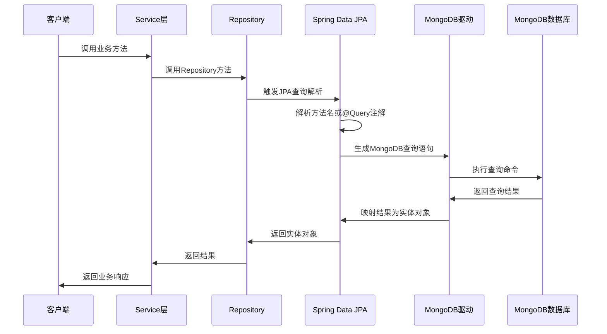

[toc]

大家好，我是你们的技术老友**科威舟**，今天给大家分享一下使用Spring Data JPA访问MongoDB。

> 当严谨的JPA遇上自由的MongoDB，会擦出怎样的火花？

在传统认知中，JPA总是与关系型数据库绑定在一起。但今天，我们要打破这个固有思维，看看Spring Data JPA如何优雅地操作非关系型数据库MongoDB，让你在享受JPA便捷的同时，获得MongoDB的强大扩展能力。

## 一、为什么选择Spring Data JPA操作MongoDB？

想象一下，JPA就像一位**精通多国语言的翻译官**，而MongoDB则是一位**自由奔放的艺术家**。传统上，这位翻译官只服务于关系型数据库这个"大家族"，但Spring Data让他学会了与MongoDB这位"艺术家"交流。

**优势对比：**

- **统一的数据访问层**：无论底层是MySQL还是MongoDB，你的代码写法基本一致
- **避免重复学习**：如果你已经熟悉JPA，无需额外学习MongoDB的特定语法
- **丰富的查询能力**：方法名查询、@Query注解、Example查询等多种方式

这就像是学会了开车，无论什么品牌的汽车，基本操作都是相似的。

## 二、Spring Data JPA与MongoDB的执行流程剖析

让我们通过一个时序图，深入了解Spring Data JPA如何与MongoDB交互：




这个过程看似复杂，但Spring Data JPA帮我们自动化了大部分工作。就像**点外卖**：你只需要下单（调用方法），平台会自动处理接单、分配骑手、送达食物（查询处理、结果映射）。

## 三、实战配置：让Spring Boot与MongoDB牵手

### 1. 添加依赖

```xml
<dependency>
    <groupId>org.springframework.boot</groupId>
    <artifactId>spring-boot-starter-data-mongodb</artifactId>
</dependency>
```

这就像是给项目装上**MongoDB驱动程序**。

### 2. 配置连接信息

在application.yml中配置：

```yaml
spring:
  data:
    mongodb:
      uri: mongodb://用户名:密码@127.0.0.1:27017/数据库名?authSource=admin
```

注意这里有个小坑：**超级管理员必须指定authSource=admin，普通用户则不能指定**。

### 3. 实体类映射

```java
@Data
@Document("device_gps")
public class DeviceGpsDO implements Serializable {
    @Id
    private String id;
    
    @CreatedDate
    @Field("create_time")
    private LocalDateTime createTime;
    
    @LastModifiedDate
    @Field("update_time")
    private LocalDateTime updateTime;
    
    @Field("device_name")
    @Indexed
    private String deviceName;
    
    @GeoSpatialIndexed(type = GeoSpatialIndexType.GEO_2DSPHERE)
    private GeoJsonPoint location;
}
```

这些注解就像是**给实体类穿上了MongoDB识别服**：
- `@Document`：指定对应的集合名称
- `@Id`：标记主键字段
- `@Field`：字段名映射
- `@Indexed`：创建索引提升查询效率
- `@GeoSpatialIndexed`：地理位置索引

## 四、多种查询方式详解

### 1. 方法名派生查询

```java
public interface DeviceGpsDao extends MongoRepository<DeviceGpsDO, String> {
    // 根据速度大于等于和预警状态查询
    List<DeviceGpsDO> findBySpeedGreaterThanEqualAndWarnStatusEquals(Float speed, Integer warnStatus);
    
    // 根据设备名称模糊查询
    List<DeviceGpsDO> findByDeviceNameLike(String deviceName);
    
    // 统计满足条件的记录数
    long countByWarnStatus(Integer warnStatus);
}
```

这种方法名查询就像**说人话一样自然**，Spring Data JPA会自动解析方法名并生成对应的查询语句。

### 2. @Query注解查询

对于复杂查询，可以使用`@Query`注解直接编写MongoDB的JSON查询语句：

```java
@Query("{ speed: {$gte : ?0}, warn_status: ?1 }")
List<DeviceGpsDO> getBySpeedAndWarnStatus(Float speed, Integer warnStatus);

// 使用对象参数传参
@Query("{ speed: {$gte : ?#{[0].speed}}, warn_status: ?#{[0].warnStatus} }")
List<DeviceGpsDO> getBySpeedAndWarnStatus(DeviceGpsDO queryParams);
```

这就像是**直接使用MongoDB原生查询**，但保持了JPA的优雅。

### 3. Example查询

```java
// 创建查询条件实例
DeviceGpsDO queryDO = new DeviceGpsDO();
queryDO.setDeviceName("监控设备");
queryDO.setWarnStatus(1);

// 设置匹配规则
ExampleMatcher matcher = ExampleMatcher.matching()
    .withIgnoreCase()  // 忽略大小写
    .withStringMatcher(ExampleMatcher.StringMatcher.CONTAINING);  // 包含匹配

Example<DeviceGpsDO> example = Example.of(queryDO, matcher);
List<DeviceGpsDO> result = deviceGpsDao.findAll(example);
```

Example查询非常适合**动态条件查询**场景，类似于QBE（Query by Example）模式。

## 五、分页查询实战

分页是实际项目中最常见的需求之一，Spring Data JPA提供了强大的分页支持：

```java
@Override
public BasePageResult pageQuery(DeviceGpsPageQueryRequest pageQueryRequest) {
    // 构造分页对象，从0开始
    int currentPage = pageQueryRequest.getCurrentPage().intValue();
    int pageSize = pageQueryRequest.getPageSize().intValue();
    PageRequest pageRequest = PageRequest.of(currentPage - 1, pageSize);
    
    // 分页查询
    Page<DeviceGpsDO> doPage = deviceGpsDao.findAll(example, pageRequest);
    
    // 获取分页信息
    log.info("当前页: {}", doPage.getNumber() + 1);
    log.info("每页大小: {}", doPage.getSize());
    log.info("总记录数: {}", doPage.getTotalElements());
    log.info("总页数: {}", doPage.getTotalPages());
    
    return new BasePageResult(doPage.getContent(), doPage.getTotalElements());
}
```

分页查询就像**看书时的翻页**，让你可以按需获取数据，避免一次性加载大量数据。

## 六、实际应用场景

### 场景一：设备监控系统

在物联网设备监控系统中，我们需要存储和查询设备的GPS信息：

```java
@Service
@RequiredArgsConstructor
public class DeviceGpsServiceImpl implements DeviceGpsService {
    private final DeviceGpsDao deviceGpsDao;
    
    @Override
    public BaseOperateResult insert(DeviceGpsDO deviceGpsDO) {
        // 处理地理位置信息
        Double longitude = deviceGpsDO.getLongitude();
        Double latitude = deviceGpsDO.getLatitude();
        if (longitude != null || latitude != null) {
            deviceGpsDO.setLocation(new GeoJsonPoint(longitude, latitude));
        }
        
        deviceGpsDao.insert(deviceGpsDO);
        return BaseOperateResult.success();
    }
    
    // 查询特定区域内的设备
    public List<DeviceGpsDO> findDevicesInArea(double centerLng, double centerLat, double radiusInKm) {
        // 使用地理空间查询查找半径内的设备
        return deviceGpsDao.findByLocationNear(new Point(centerLng, centerLat), 
                                              new Distance(radiusInKm, Metrics.KILOMETERS));
    }
}
```

### 场景二：电商用户行为日志

在电商平台中，使用MongoDB存储用户行为日志：

```java
@Document("user_behavior_log")
@Data
public class UserBehaviorLog {
    @Id
    private String id;
    private Long userId;
    private String behaviorType; // 浏览、点击、购买等
    private String pageUrl;
    private String productId;
    private Date createTime;
    private Map<String, Object> extraParams; // 额外参数，MongoDB适合存储这种灵活结构
}

// 查询用户最近的行为记录
List<UserBehaviorLog> findTop10ByUserIdOrderByCreateTimeDesc(Long userId);
```

MongoDB的**灵活模式**特别适合这种需求多变的日志存储场景。

## 七、常见问题与解决方案

### 1. 时区问题

MongoDB默认使用UTC时间，可能导致前端显示有8小时时差：

```java
// 推荐使用LocalDateTime，不存在时差问题
@Field("create_time")
private LocalDateTime createTime;

// 如果使用Date，需要指定时区
@JsonFormat(timezone = "GMT+8", pattern = "yyyy-MM-dd HH:mm:ss")
private Date createTime;
```

**推荐使用LocalDateTime**，可以避免时区转换的麻烦。

### 2. _class字段问题

Spring Data MongoDB默认会在文档中添加`_class`字段用于存储实体类类型。可以通过配置禁用：

```java
@Configuration
public class MongoDBConfig implements InitializingBean {
    @Resource
    private MappingMongoConverter mappingMongoConverter;
    
    @Override
    public void afterPropertiesSet() {
        // 禁用 "_class" 字段
        mappingMongoConverter.setTypeMapper(new DefaultMongoTypeMapper(null));
    }
}
```

这个`_class`字段就像**商品的标签**，有助于识别但并非必需。

### 3. 审计功能

使用`@CreatedDate`和`@LastModifiedDate`实现自动时间戳：

```java
@Document("device_gps")
public class DeviceGpsDO {
    @CreatedDate
    @Field("create_time")
    private LocalDateTime createTime;
    
    @LastModifiedDate
    @Field("update_time")
    private LocalDateTime updateTime;
}

// 在启动类上添加注解
@EnableMongoAuditing
@SpringBootApplication
public class Application {
    public static void main(String[] args) {
        SpringApplication.run(Application.class, args);
    }
}
```

注意：**`@CreatedDate`只在id为空时生效**，这符合逻辑因为创建时间只在首次插入时设置。

## 八、总结

Spring Data JPA与MongoDB的结合，就像是**传统的西方医学与中医的结合**——JPA提供了标准化的操作流程（西方医学的标准化），而MongoDB提供了灵活的存储模式（中医的个性化治疗）。

这种组合的优势在于：

1. **开发效率高**：基于Spring Data JPA的熟悉语法
2. **灵活性好**：MongoDB的文档模型适应需求变化
3. **可扩展性强**：MongoDB的分布式特性支持海量数据存储
4. **维护成本低**：统一的API减少学习成本

当然，这种方案也有适用场景：**最适合需要快速迭代、数据结构变化频繁的项目**。对于事务一致性要求极高的系统，还是建议使用关系型数据库。

希望通过这篇文章，你能掌握使用Spring Data JPA操作MongoDB的技巧，并在实际项目中灵活运用！

---
更多技术干货欢迎关注微信公众号**科威舟的AI笔记**~


【转载须知】：**转载请注明原文出处及作者信息**

