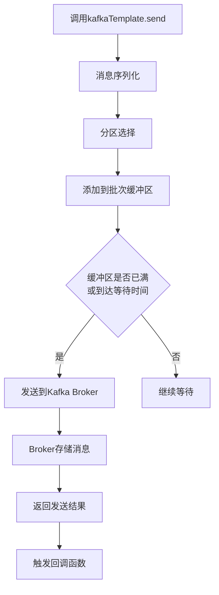

> 消息队列是现代分布式系统的血脉，而Kafka就是其中最强健的心脏。今天我们一起探索如何在SpringBoot中玩转Kafka。

在微服务架构大行其道的今天，服务之间的通信变得愈发重要。同步通信如同打电话，需要对方实时响应；而异步通信则像发短信，发送后就可以继续处理其他事情。Kafka就是这样一个高性能的异步消息系统，每秒可处理数百万条消息。

## 一、Kafka核心概念：快递系统比喻

先通过一个比喻来理解Kafka的核心概念：想象一个**快递系统**。

- **Topic（主题）**：好比是**快递类型**（文件、包裹、生鲜），不同主题处理不同类型的消息
- **Producer（生产者）**：像**发货人**，发送消息到指定主题
- **Consumer（消费者）**：像**收件人**，从主题收取消息
- **Broker**：就是**快递网点**，负责消息的存储和转发
- **Partition（分区）**：如同快递公司的**不同运输路线**，提高并发能力
- **Consumer Group**：好比是**收件部门**，部门内多人共同处理快递

## 二、SpringBoot集成Kafka实战

### 1. 添加依赖

在pom.xml中添加spring-kafka依赖：

```xml
<dependency>
    <groupId>org.springframework.kafka</groupId>
    <artifactId>spring-kafka</artifactId>
</dependency>
```

SpringBoot会自动配置Kafka相关bean，开箱即用。

### 2. 基础配置

在application.yml中配置Kafka：

```yaml
spring:
  kafka:
    bootstrap-servers: localhost:9092
    producer:
      key-serializer: org.apache.kafka.common.serialization.StringSerializer
      value-serializer: org.apache.kafka.common.serialization.StringSerializer
      acks: all # 消息可靠性保证
      retries: 3 # 重试次数
    consumer:
      group-id: my-group
      auto-offset-reset: earliest
      enable-auto-commit: false # 手动提交偏移量
      key-deserializer: org.apache.kafka.common.serialization.StringDeserializer
      value-deserializer: org.apache.kafka.common.serialization.StringDeserializer
```

关键配置说明：
- **acks=all**：确保消息被所有副本确认，可靠性最高
- **enable-auto-commit=false**：手动提交偏移量，避免消息丢失
- **auto-offset-reset=earliest**：在没有初始偏移量时从最早消息开始消费

### 3. 消息生产者

创建KafkaTemplate包装类：

```java
@Service
@Slf4j
public class KafkaProducerService {
    
    @Autowired
    private KafkaTemplate<String, String> kafkaTemplate;
    
    public void sendMessage(String topic, String message) {
        // 异步发送
        kafkaTemplate.send(topic, message).addCallback(
            result -> {
                String topic = result.getRecordMetadata().topic();
                int partition = result.getRecordMetadata().partition();
                long offset = result.getRecordMetadata().offset();
                log.info("消息发送成功: {}-{}-{}", topic, partition, offset);
            },
            failure -> {
                log.error("消息发送失败: {}", failure.getMessage());
                // 这里可以添加重试逻辑
            }
        );
    }
    
    // 同步发送（适用于需要确保消息发送成功的场景）
    public void sendMessageSync(String topic, String message) throws Exception {
        SendResult<String, String> result = kafkaTemplate.send(topic, message).get();
        log.info("同步发送成功: {}", result.getRecordMetadata());
    }
}
```

### 4. 消息消费者

```java
@Service
@Slf4j
public class KafkaConsumerService {
    
    // 基础消费模式
    @KafkaListener(topics = "order-topic", groupId = "order-group")
    public void consumeOrderMessage(String message) {
        log.info("收到订单消息: {}", message);
        // 业务处理逻辑
    }
    
    // 手动提交偏移量
    @KafkaListener(topics = "payment-topic", groupId = "payment-group")
    public void consumePaymentMessage(String message, Acknowledgment ack) {
        try {
            log.info("处理支付消息: {}", message);
            // 业务处理
            processPayment(message);
            // 手动提交偏移量
            ack.acknowledge();
        } catch (Exception e) {
            log.error("支付消息处理失败: {}", message, e);
            // 可根据业务需求决定是否重试
        }
    }
}
```

## 三、Kafka消息发送流程剖析

下面通过流程图展示KafkaTemplate发送消息的完整过程：



**流程详解**：

1. **序列化阶段**：将Java对象序列化为字节数组，减少网络传输开销
2. **分区选择**：根据key的hash值或轮询策略选择目标分区
3. **批次处理**：相同分区的消息会被批量发送，提高吞吐量
4. **Broker处理**：Leader副本接收消息并同步到Follower副本
5. **结果返回**：根据配置的acks参数返回发送结果

## 四、实战场景深度解析

### 场景一：订单超时处理（精准延时消息）

电商场景中，订单30分钟未支付自动取消：

```java
@Service
public class OrderTimeoutService {
    
    @Autowired
    private KafkaTemplate<String, String> kafkaTemplate;
    
    public void createOrder(Order order) {
        // 保存订单到数据库
        orderService.save(order);
        
        // 发送延时消息（30分钟超时）
        String timeoutKey = "order_timeout:" + order.getId();
        ProducerRecord<String, String> record = new ProducerRecord<>(
            "order-timeout-topic", 0, System.currentTimeMillis() + 30 * 60 * 1000, 
            timeoutKey, order.getId().toString()
        );
        kafkaTemplate.send(record);
    }
    
    @KafkaListener(topics = "order-timeout-topic", groupId = "order-timeout-group")
    public void checkOrderTimeout(String orderId) {
        Order order = orderService.getById(orderId);
        if (order != null && "unpaid".equals(order.getStatus())) {
            // 执行取消订单逻辑
            orderService.cancelOrder(orderId);
        }
    }
}
```

### 场景二：用户行为追踪（海量日志处理）

```java
@Service
@Slf4j
public class UserBehaviorService {
    
    @Autowired
    private KafkaTemplate<String, Object> kafkaTemplate;
    
    // 批量发送用户行为日志
    public void trackUserBehavior(List<UserBehavior> behaviors) {
        // 使用Snappy压缩减少网络传输
        kafkaTemplate.executeInTransaction(template -> {
            for (UserBehavior behavior : behaviors) {
                template.send("user-behavior-topic", behavior.getUserId(), behavior);
            }
            return true;
        });
    }
    
    // 批量消费处理
    @KafkaListener(topics = "user-behavior-topic", groupId = "behavior-analytics-group")
    public void batchProcessBehaviors(List<UserBehavior> behaviors) {
        log.info("批量处理{}条用户行为", behaviors.size());
        
        // 批量入库或实时分析
        behaviorAnalysisService.batchProcess(behaviors);
    }
}
```

**配置优化**：

```yaml
spring:
  kafka:
    producer:
      compression-type: snappy # 压缩传输
      batch-size: 16384 # 批量大小
      linger-ms: 20     # 批次等待时间
    consumer:
      max-poll-records: 500 # 单次最大拉取条数
      fetch-min-size: 524288 # 最小拉取数据量
```

### 场景三：事件驱动架构（微服务解耦）

在微服务架构中，Kafka作为事件总线解耦服务：

```java
// 订单服务 - 生产者
@Service
public class OrderEventPublisher {
    
    @Autowired
    private KafkaTemplate<String, Object> kafkaTemplate;
    
    public void publishOrderCreated(OrderCreatedEvent event) {
        // 确保事件发送与数据库事务一致性
        TransactionSynchronizationManager.registerSynchronization(
            new TransactionSynchronization() {
                @Override
                public void afterCommit() {
                    kafkaTemplate.send("order-events", event.getOrderId(), event);
                }
            }
        );
    }
}

// 库存服务 - 消费者
@Service
public class InventoryEventConsumer {
    
    @KafkaListener(topics = "order-events", groupId = "inventory-group")
    public void consumeOrderEvent(OrderCreatedEvent event) {
        log.info("处理订单创建事件: {}", event.getOrderId());
        inventoryService.reduceStock(event.getProductId(), event.getQuantity());
    }
}

// 通知服务 - 消费者  
@Service
public class NotificationEventConsumer {
    
    @KafkaListener(topics = "order-events", groupId = "notification-group")
    public void consumeOrderEvent(OrderCreatedEvent event) {
        log.info("发送订单创建通知: {}", event.getOrderId());
        notificationService.sendOrderConfirm(event.getUserId(), event.getOrderId());
    }
}
```

## 五、性能优化实战技巧

### 1. 生产者性能调优

```java
@Configuration
public class KafkaProducerConfig {
    
    @Value("${spring.kafka.bootstrap-servers}")
    private String bootstrapServers;
    
    @Bean
    public ProducerFactory<String, Object> producerFactory() {
        Map<String, Object> props = new HashMap<>();
        props.put(ProducerConfig.BOOTSTRAP_SERVERS_CONFIG, bootstrapServers);
        props.put(ProducerConfig.KEY_SERIALIZER_CLASS_CONFIG, StringSerializer.class);
        props.put(ProducerConfig.VALUE_SERIALIZER_CLASS_CONFIG, JsonSerializer.class);
        
        // 性能优化参数
        props.put(ProducerConfig.BATCH_SIZE_CONFIG, 16384); // 16KB批次大小
        props.put(ProducerConfig.LINGER_MS_CONFIG, 20);     // 最大等待20ms
        props.put(ProducerConfig.COMPRESSION_TYPE_CONFIG, "snappy"); // 压缩
        props.put(ProducerConfig.BUFFER_MEMORY_CONFIG, 33554432); // 缓冲区32MB
        props.put(ProducerConfig.MAX_IN_FLIGHT_REQUESTS_PER_CONNECTION, 5);
        
        return new DefaultKafkaProducerFactory<>(props);
    }
}
```

### 2. 消费者并发优化

```java
@Configuration
@EnableKafka
public class KafkaConsumerConfig {
    
    @Bean
    public ConcurrentKafkaListenerContainerFactory<String, Object> kafkaListenerContainerFactory() {
        ConcurrentKafkaListenerContainerFactory<String, Object> factory = 
            new ConcurrentKafkaListenerContainerFactory<>();
        factory.setConsumerFactory(consumerFactory());
        factory.setConcurrency(3); // 根据分区数设置并发数
        factory.getContainerProperties().setAckMode(ContainerProperties.AckMode.MANUAL);
        return factory;
    }
    
    // 批量消费配置
    @Bean
    public ConcurrentKafkaListenerContainerFactory<String, Object> batchFactory() {
        ConcurrentKafkaListenerContainerFactory<String, Object> factory = 
            new ConcurrentKafkaListenerContainerFactory<>();
        factory.setConsumerFactory(consumerFactory());
        factory.setBatchListener(true); // 开启批量监听
        factory.setConcurrency(3);
        return factory;
    }
}
```

## 六、常见问题与解决方案

### 1. 消息重复消费问题

**原因**：消费者提交偏移量失败后重试导致消息重复消费。

**解决方案**：实现**幂等消费**：

```java
@Service
public class IdempotentConsumer {
    
    @KafkaListener(topics = "payment-topic", groupId = "payment-group")
    public void processPayment(PaymentMessage message, Acknowledgment ack) {
        // 基于消息ID实现幂等
        if (paymentService.isMessageProcessed(message.getMessageId())) {
            log.info("消息已处理，直接跳过: {}", message.getMessageId());
            ack.acknowledge();
            return;
        }
        
        // 处理业务逻辑
        paymentService.processPayment(message);
        
        // 记录已处理消息ID
        paymentService.markMessageProcessed(message.getMessageId());
        ack.acknowledge();
    }
}
```

### 2. 消息顺序性保证

**场景**：同一订单的状态变更需要按顺序处理。

**解决方案**：

```java
@Service
public class OrderStateProcessor {
    
    // 使用相同key确保同一订单的消息进入同一分区
    public void sendOrderEvent(OrderEvent event) {
        String key = event.getOrderId(); // 使用订单ID作为key
        kafkaTemplate.send("order-events", key, event);
    }
    
    @KafkaListener(topics = "order-events", groupId = "order-processor-group")
    public void processOrderEvent(OrderEvent event) {
        // 同一分区的消息按顺序处理
        orderService.handleStateTransition(event);
    }
}
```

### 3. 死信队列处理

```java
@Service
public class RetryableMessageConsumer {
    
    // 重试机制配置
    @RetryableTopic(
        attempts = "3",  // 重试3次
        backoff = @Backoff(delay = 1000, multiplier = 2),
        topicSuffixingStrategy = TopicSuffixingStrategy.SUFFIX_WITH_INDEX_VALUE
    )
    @KafkaListener(topics = "business-topic", groupId = "business-group")
    public void consumeBusinessMessage(String message) {
        try {
            businessService.process(message);
        } catch (Exception e) {
            log.error("消息处理失败: {}", message, e);
            throw e; // 触发重试
        }
    }
    
    // 死信队列处理
    @KafkaListener(topics = "business-topic-retry-2", groupId = "business-dlq-group")
    public void processDeadLetterMessage(String message) {
        deadLetterService.processFailedMessage(message);
    }
}
```

## 七、监控与运维

### 1. 应用监控集成

```xml
<dependency>
    <groupId>io.micrometer</groupId>
    <artifactId>micrometer-registry-prometheus</artifactId>
</dependency>
```

### 2. 关键监控指标

- **生产者指标**：消息发送速率、失败重试次数、批次大小
- **消费者指标**：消费延迟（lag）、提交偏移量频率、处理耗时
- **Broker指标**：分区数、ISR状态、网络吞吐量

## 八、总结

SpringBoot集成KafkaTemplate提供了强大而灵活的消息传递能力，关键在于：

1. **合理配置**：根据业务场景调整生产者和消费者参数
2. **容错设计**：实现幂等消费、重试机制和死信队列
3. **性能优化**：批量处理、压缩传输和合理分区策略
4. **监控告警**：建立完整的监控体系，及时发现问题

记住，**没有最好的配置，只有最适合业务的配置**。在实际项目中，需要根据消息的重要性、吞吐量要求和资源情况灵活调整。

希望本文能帮助你在SpringBoot项目中更好地使用Kafka！如果你有更好的实践方案，欢迎交流讨论。

## 参考资料

1. [Spring Boot集成Kafka消息系统 - 亿速云]
2. [Spring Boot 集成 Kafka 及实战技巧总结 - CSDN博客]
3. [Spring Boot学习（三十三）：集成kafka - CSDN博客]
4. [手拉手springboot整合kafka发送消息 - 华为云社区]
5. [关于KafkaTemplate与@KafkaListener实现 - CSDN博客]
6. [spring boot 集成kafka - 51CTO博客]