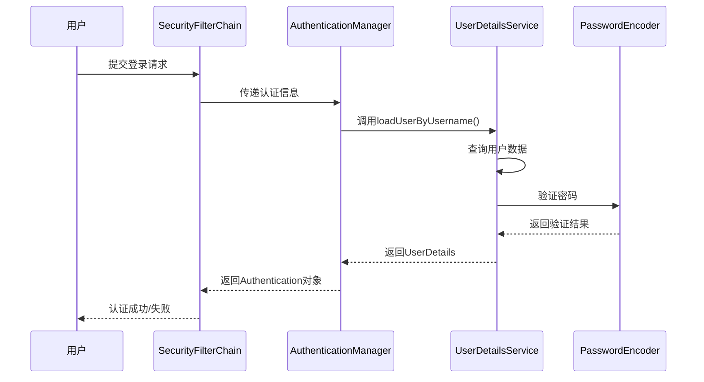
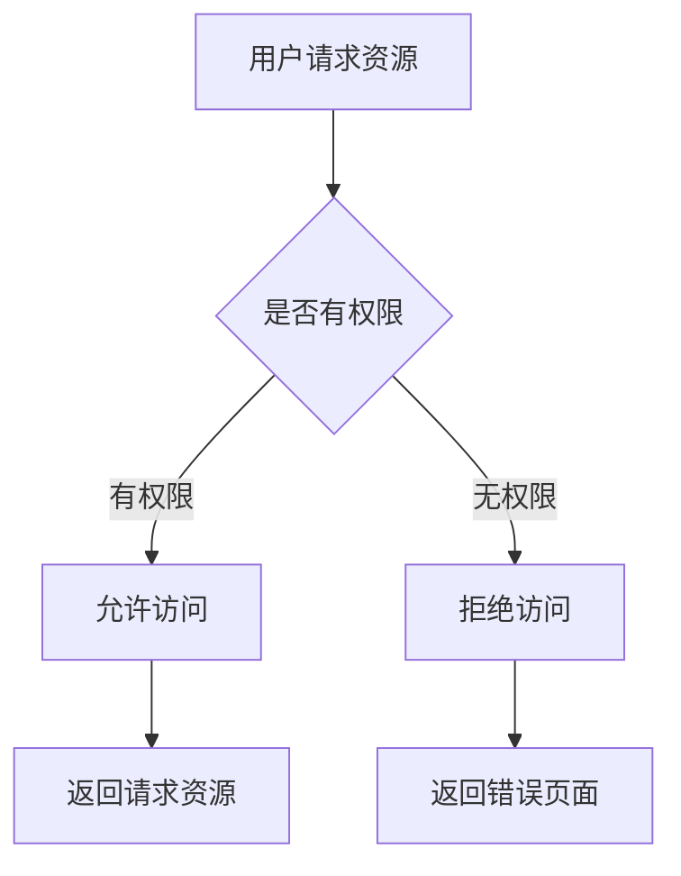

> 不懂安全框架的程序员，就像没有锁的门户

在当今数字化时代，应用安全已成为软件开发的**核心需求**。想象一下，你精心打造的Web应用就像一栋豪华别墅，而Spring Security就是那套先进的安全系统——它不仅能识别住户身份（认证），还能控制谁能进入哪个房间（授权）。

## 一、Spring Security核心架构：安全系统的设计蓝图

Spring Security的底层基于**Servlet过滤器和AOP技术**，通过一系列过滤器组成"过滤器链"来拦截请求并进行安全控制。这就像大厦的安保流程：进入大门需要刷卡（认证），进入特定区域需要权限验证（授权）。

**核心组件体系**如下：

| 组件 | 作用 | 现实比喻 |
|------|------|----------|
| SecurityContextHolder | 存储当前用户安全上下文 | 保安亭的访客记录本 |
| AuthenticationManager | 认证管理器，负责认证逻辑调度 | 前台接待员 |
| UserDetailsService | 加载用户信息（通常查数据库） | 人事档案系统 |
| AccessDecisionManager | 授权决策管理器 | 部门经理，决定员工权限 |

Spring Security的架构建立在三个基础支柱之上：安全过滤器链（处理HTTP请求的第一道防线）、认证管理器（验证用户身份的中央枢纽）和访问决策管理器（控制资源访问权限的决策中心）。

## 二、认证流程：识别用户身份的艺术

认证就是回答"**你是谁？**"这个问题的过程。当用户尝试访问受保护资源时，系统需要确认其身份的真实性。

### 认证流程时序图



认证过程遵循标准流程：认证请求（用户提交凭据）、认证处理（AuthenticationManager委托AuthenticationProvider进行认证）、认证结果（认证成功生成Authentication对象并存入SecurityContext）、安全上下文传播（SecurityContextHolder在整个请求处理过程中保持认证状态）。

具体实现中，最常用的AuthenticationProvider是DaoAuthenticationProvider，它用于基于数据库的用户名/密码认证。它会调用UserDetailsService.loadUserByUsername()方法，并返回用户信息（含密码、权限），然后使用PasswordEncoder进行密码比对。

## 三、授权机制：权限控制的精密齿轮

授权是回答"**你能做什么？**"的过程。即使用户身份合法，系统也需要根据其被授予的权限来判断其是否有权访问特定资源。

### 授权决策流程图



授权发生在认证之后，通过FilterSecurityInterceptor过滤器进行。当请求到达FilterSecurityInterceptor时，会触发完整的授权决策流程：参数准备阶段（FilterSecurityInterceptor通过SecurityMetadataSource获取当前请求路径所需的权限集合）和投票决策阶段（将Authentication对象、受保护对象和权限要求传递给AccessDecisionManager的decide方法）。

AccessDecisionManager采用**策略模式**来决定是否允许访问特定资源。Spring Security提供了三种内置决策策略：AffirmativeBased（任一投票通过即允许访问）、ConsensusBased（多数同意原则）和UnanimousBased（要求全体一致通过）。

## 四、过滤器链：安全防线的层层把关

Spring Security的安全模型建立在Servlet过滤器机制之上，但不同于传统的单个过滤器设计，它采用了**创新的链式过滤器架构**。

**核心过滤器及其作用**：

1. **SecurityContextPersistenceFilter**：在请求开始时建立安全上下文，结束时清理
2. **UsernamePasswordAuthenticationFilter**：处理表单登录认证
3. **BasicAuthenticationFilter**：处理HTTP Basic认证
4. **AnonymousAuthenticationFilter**：为未认证用户创建匿名身份
5. **ExceptionTranslationFilter**：处理安全异常转换
6. **FilterSecurityInterceptor**：执行最终授权决策

FilterChainProxy作为入口点，实际上是一个特殊的Servlet过滤器，负责协调和管理多个SecurityFilterChain实例。在2025年的实现中，FilterChainProxy的智能路由能力得到进一步增强，能够基于请求路径、内容类型甚至请求来源动态选择最匹配的安全过滤器链。

## 五、现代配置方式：从传统到现代的演进

随着Spring Security版本的迭代，其配置方式也从传统的继承类模式转向了更现代、更灵活的**组件化配置模式**。

在Spring Security 5.7之前，自定义安全配置的通用做法是继承WebSecurityConfigurerAdapter类。然而，这种方式存在一些局限，例如配置耦合度高、难以实现多个独立的、有条件的配置链。

新的推荐方式是直接在@Configuration配置类中定义一个或多个SecurityFilterChain类型的@Bean。这种转变的好处是**解耦**（每个SecurityFilterChain Bean都是一个独立的、自包含的安全配置单元）、**灵活性**（可以根据不同的请求路径定义不同的安全过滤链）和**清晰性**（配置逻辑更加清晰）。

## 六、实战案例：多场景下的安全配置

### 1. 基于JWT的无状态API认证

在微服务架构中，JWT（JSON Web Token）是**无状态认证**的理想选择。集成JWT认证的步骤：

```java
@Component
public class JwtAuthenticationFilter extends OncePerRequestFilter {
    @Override
    protected void doFilterInternal(HttpServletRequest request, 
                                  HttpServletResponse response, 
                                  FilterChain filterChain) {
        // 从请求头提取JWT
        String jwt = getJwtFromRequest(request);
        
        if (StringUtils.hasText(jwt) && jwtTokenProvider.validateToken(jwt)) {
            // 从JWT中解析用户信息并设置认证上下文
            Authentication auth = jwtTokenProvider.getAuthentication(jwt);
            SecurityContextHolder.getContext().setAuthentication(auth);
        }
        filterChain.doFilter(request, response);
    }
}
```

配置SecurityFilterChain时需要禁用CSRF（因为JWT认证是无状态的，且通常用于API）并将Session管理策略设置为无状态STATELESS（因为服务器不再需要维护用户会话）。

### 2. 方法级安全控制

除了通过HttpSecurity配置URL级别的访问控制，Spring Security还支持在**方法级别**进行更细粒度的授权。这对于保护Service层的业务方法非常有用。

```java
@Service
public class OrderService {
    @PreAuthorize("hasRole('ADMIN') or #userId == authentication.principal.id")
    public List<Order> getUserOrders(Long userId) {
        // 只有管理员或用户本人可查询订单
        return orderRepository.findByUserId(userId);
    }
    
    @PostAuthorize("returnObject.owner == authentication.name")
    public Document getDocument(String docId) {
        // 只能访问属于自己的文档
        return documentRepository.findById(docId);
    }
}
```

要使用方法级安全控制，需要在配置类上添加@EnableMethodSecurity注解。

### 3. 动态权限控制

在复杂应用中，静态权限配置往往不够灵活。Spring Security支持**动态权限控制**：

```java
@Component
public class DynamicPermissionEvaluator implements PermissionEvaluator {
    @Override
    public boolean hasPermission(Authentication authentication, 
                               Object targetDomainObject, 
                               Object permission) {
        // 实现基于业务逻辑的动态权限检查
        return permissionService.checkPermission(
            authentication.getName(), 
            targetDomainObject, 
            permission.toString()
        );
    }
}
```

## 七、安全最佳实践

1. **密码编码**：永远不要以明文存储密码。Spring Security强烈建议使用PasswordEncoder，BCryptPasswordEncoder是当前广泛使用的强大加密器。Spring Security 5.0之后，推荐使用DelegatingPasswordEncoder作为默认的密码编码器，它可以支持多种加密算法，并根据存储的密码前缀来选择合适的编码器进行匹配，便于平滑迁移。

2. **CSRF防护**：对于有状态的Web应用，务必启用CSRF防护。

3. **安全头部配置**：增加安全头部防止常见攻击：
```java
http.headers(headers -> headers
    .contentSecurityPolicy(csp -> csp.policyDirectives("default-src 'self'"))
    .frameOptions(HeadersConfigurer.FrameOptionsConfig::sameOrigin)
)
```

4. **安全审计**：记录关键安全事件便于监控和故障排除：
```java
@Component
public class SecurityAuditListener {
    @EventListener
    public void onAuthenticationSuccess(AuthenticationSuccessEvent event) {
        logger.info("用户 {} 登录成功", event.getAuthentication().getName());
    }
}
```

## 总结

Spring Security是一个功能丰富且高度可定制的安全框架，它的**模块化架构**和丰富的扩展点使得开发者能够根据具体需求定制安全策略。通过深入理解过滤器链、认证授权机制等核心概念，开发者可以构建出既安全又灵活的应用系统。

无论是传统的MVC应用还是现代的微服务架构，Spring Security都能提供**强有力的安全保障**。掌握Spring Security不仅是为了应对当下的开发需求，更是为了构建面向未来的安全应用架构。

## 参考文章

1. https://blog.csdn.net/josuke66/article/details/149861448
2. https://blog.csdn.net/zuiyuelong/article/details/150452841
3. https://blog.51cto.com/u_16099281/14352415
4. https://developer.aliyun.com/article/1680275
5. https://download.csdn.net/download/weixin_42118701/16234442

---

*本文仅供技术学习参考，具体实现请根据项目实际情况进行调整。安全无小事，实践前建议充分测试。*