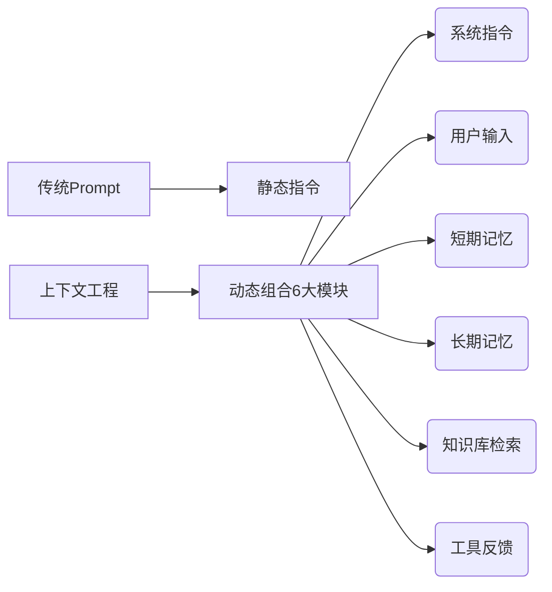
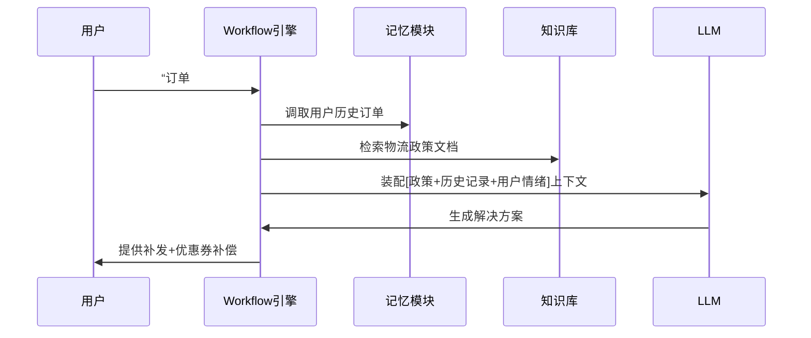

[toc]

> 本文主要介绍了大模型的上下文工程，下文工程：智能体系统的核心竞争力——超越Prompt Engineering的新范式

---

## 上下文工程：智能体系统的核心竞争力——超越Prompt Engineering的新范式
**文/AI技术架构观察者**
> 当业界还在争论提示词技巧时，顶尖AI团队已转向更本质的战场：如何为智能体精准装配“上下文燃料”。

---

### 一、什么是上下文工程？
**定义演进**：
- **Prompt Engineering**（提示工程）：优化给LLM的指令文本（如“你是一名资深医生”）
- **Context Engineering**（上下文工程）：**动态装配任务所需的多元信息模块**，突破单一指令局限

**本质差异**：


> 正如Andrey Karpathy所言：工业级LLM应用的核心，是将**有限上下文窗口**填充为**最大化价值的信息矩阵**

---

### 二、上下文工程的四大技术支柱
#### 1. 智能源选择机制
- **挑战**：多知识库/工具并存时的资源调度
- **方案**：
  ```python
  # LlamaIndex 工具定义示例
  @tool
  def search_finance_db(query: str) -> str:
      """从财经数据库检索近3年数据，query需为具体问题"""
      # 实现向量检索+时间过滤逻辑
      return filtered_data
  ```
  **关键点**：工具描述本身即重要上下文，引导智能体决策路径

#### 2. 上下文压缩技术
- **空间优化策略**：
    - 摘要压缩：对检索结果先摘要再注入
    - 关键提取：用LlamaExtract抽取结构化数据（如财报关键指标）
    - 优先级排序：时效性数据按时间倒排

#### 3. 记忆系统设计
**LlamaIndex 记忆模块对比**：  
| 模块类型           | 适用场景                  | 数据示例                |
|--------------------|-------------------------|-----------------------|
| VectorMemoryBlock  | 需要语义检索的对话历史    | 用户过往提问及反馈     |
| FactMemoryBlock    | 需持久化存储的关键事实    | 用户偏好、系统配置      |
| StaticMemoryBlock  | 固定业务规则             | “折扣政策有效期至2024年底” |

#### 4. 结构化上下文装配
- **双向价值**：
    - 输入侧：JSON Schema约束LLM输出格式
    - 输出侧：表格数据比文本更节省token
```json
{
  "required": ["company", "revenue", "growth_rate"],
  "type": "object"
}
```

---

### 三、工程实践：LlamaIndex工作流引擎
**为什么需要工作流？**
> 当任务复杂度超过单次LLM调用极限时，上下文工程需升级为**流程工程**

**实战案例：客户投诉处理智能体**


**技术优势**：
1. **解耦复杂任务**：拆分为可管理上下文单元
2. **精准上下文注入**：各步骤仅加载必要信息
3. **内置容错机制**：自动重试/人工接管流程

---

### 四、行业趋势与挑战
#### 1. 认知升级路线图


#### 2. 待解难题
- **上下文窗口悖论**：  
  虽然Claude 3支持200K token，但**信息密度下降60%时**（OpenAI研究），模型性能反降
- **冷启动困境**：  
  新智能体缺乏历史交互数据时的上下文贫瘠问题
- **多模态挑战**：  
  如何统一处理文本/图像/表格的上下文融合

---

### 结语：从技巧到架构的范式转移
> 当GPT-5将突破百万级上下文窗口，**信息筛选能力**比信息获取能力更重要。上下文工程本质是：
> - **数据价值的蒸馏术**
> - **LLM认知边界的拓展器**
> - **智能体进化的核心DNA**

**行动建议**：
1. 用LlamaCloud搭建带记忆的客服原型（免费版支持10K文档）
2. 在Kaggle竞赛中测试上下文压缩算法（如TextRank vs LLM摘要）
3. 关注**上下文感知计算**（Context-Aware Computing）与神经符号融合新进展

> 技术不会等待犹豫者：当同行还在调提示词时，你已开始在更高维度构建认知引擎。

（本文代码示例基于LlamaIndex 1.0+，实验环境Colab Pro）